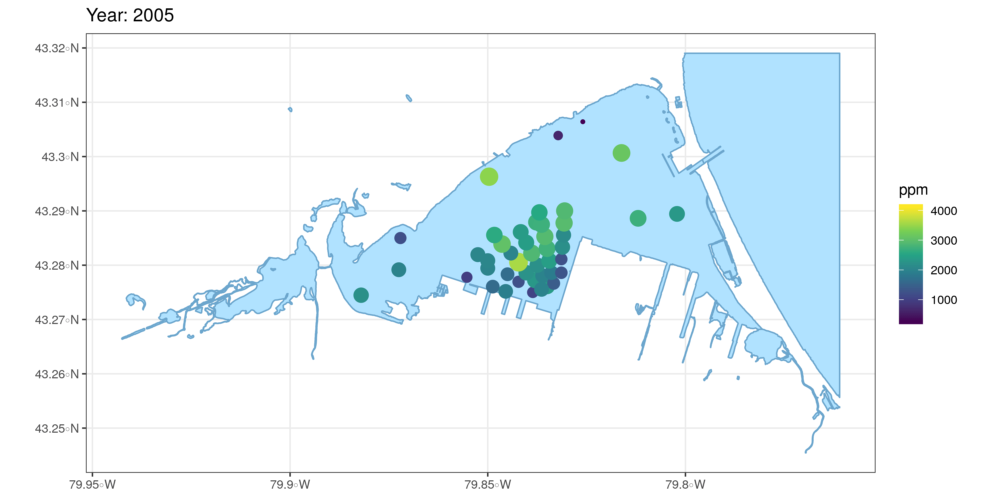

class: title-slide, middle

</img>
</img>

# Distance weighted interpolation with R

.instructors[
  GSFE01 - F. Guillaume Blanchet & Steve Vissault
]


---
class: inverse, middle, center

# Data description
<html><div style='float:left'></div><hr color='#EB811B' size=3px width=720px></html> 

---
# Data description

**Sampling sites in the Harbour of Hamilton (Ontario)**

```{r setup, include=FALSE}
options(htmltools.dir.version = FALSE)
```

```{r, echo = FALSE, out.width="100%", out.height="60%"}
library(mapview)
sites <- readRDS("../data/post_process/hamilton_sites.rds")
mapview(sites)
```

Part of the CABIN Canadian Aquatic Biomonitoring Network: The Canadian Aquatic
Biomonitoring Network (CABIN) is an aquatic biomonitoring program for assessing
the health of fresh water ecosystems in Canada. 

---
# Data 

**Sampling sites in the Harbour of Hamilton (Ontario)**

```{r, echo = FALSE}
habitat <- readRDS("../data/post_process/hamilton_habitat.rds")
```

`r length(unique(habitat$Variable))` abiotic variables sampled ([Download the file](https://github.com/SteveViss/PR-GSFE01/raw/master/data/post_process/hamilton_sites.rds))

Name of the first 10 variables used to monitor water quality
```{r, echo = FALSE}
unique(habitat$Variable)[1:10]
```

We will focus on the Total Phosphorus (ppm) for the years 2005 to 2007 and 2014.

---
class: inverse, middle, center

# Mathematical formalisms
<html><div style='float:left'></div><hr color='#EB811B' size=3px width=720px></html> 

---

# Mathematical formalisms
Spatial coordinate of sample $i$ (out of $m$)

$$\mathbf{s}_i$$

Time when sample $j$ were gathered (out of $T$)

$$t_j$$
A value associated to the sampled (observed) data

$$Z(\mathbf{s}_i, t_j)$$
A value associated to the sampled data if only spatial data is available

$$Z(\mathbf{s}_i)$$
The vector of value associated to the sampled data across all samples gathered at time $t_j$

$$\mathbf{Z}_{t_j}$$

---

# Spatial Mean

If we want to focus only on spatial information of a spatiotemporal data, we can average over time

$$\widehat{\mu}_{z,s}(\mathbf{s}_i) \equiv \frac{1}{T}\sum_{j = 1}^TZ(\mathbf{s}_i, t_j)$$
The previous equation focuses only on a single sample. It can be generalized to be applied to multiple samples

$$\widehat{\boldsymbol\mu}_{z,s}=\begin{bmatrix}
\widehat{\mu}_{z,s}(\mathbf{s}_1)\\
\vdots\\
\widehat{\mu}_{z,s}(\mathbf{s}_m)
\end{bmatrix}=\begin{bmatrix}
\frac{1}{T}\sum_{j = 1}^TZ(\mathbf{s}_1, t_j)\\
\vdots\\
\frac{1}{T}\sum_{j = 1}^TZ(\mathbf{s}_m, t_j)
\end{bmatrix}=\frac{1}{T}\sum_{j = 1}^T\mathbf{Z}_{t_j}$$

---

# Spatial Mean 

```{r echo=FALSE, out.width="100%", fig.align='center'}
knitr::include_graphics("./assets/img/hamilton_tp.png")
```

---

# Spatial Mean 

```{r echo=FALSE, out.width="100%", fig.align='center'}

```

---

# Spatial Covariance

Studying the covariance in spatial data is useful because it gives us insight about how different samples behave similarly across space and/or through time

For a pair of samples
$$\widehat{C}_z^{(\tau)}(\mathbf{s}_i,\mathbf{s}_k) \equiv \frac{1}{T-\tau}\sum_{j = \tau + 1}^T \left(Z(\mathbf{s}_i, t_j) - \widehat{\mu}_{z,s}(\mathbf{s}_i)\right)\left(Z(\mathbf{s}_k, t_j - \tau) - \widehat{\mu}_{z,s}(\mathbf{s}_k)\right)$$
where $\tau$ are time lag ranging from $0, 1, \dots,T$. Note that this equation calculates the covariance values associated to a single time lag.

This equation can be generalized to account for all pairs of spatial samples for a single time lag

$$\widehat{\mathbf{C}}_z^{(\tau)} \equiv \frac{1}{T-\tau}\sum_{j = \tau + 1}^T \left(\mathbf{Z}_{t_j} - \widehat{\boldsymbol{\mu}}_{z,s}\right)\left(\mathbf{Z}_{t_j-\tau} - \widehat{\boldsymbol{\mu}}_{z,s}\right)^\top$$
where $\top$ is the transpose of a matrix.

---

# Spatial Covariance
 

```{r echo=FALSE, out.width="100%", fig.align='center'}

```

---
class: inverse, center, middle

# Inverse distance weighting

<html><div style='float:left'></div><hr color='#EB811B' size=1px width=720px></html> 


---

# Inverse distance weighting

The first way that comes to mind when one want to account for spatial and spatiotemporal data is to give

- More weights to the nearest samples (and less weight to the distant samples)
- More weights to the samples more recently gathered (and less weight to the sample gathered a long time ago)

This is the underlying idea behind *inverse distance weighting*.


---

# How it works

## Step 1 - structure of the data

Suppose we gathered a spatiotemporal data where for each time $t_j$ we have $m_j$ spatial observation

$$\begin{bmatrix}
Z(\mathbf{s}_{1_1}, t_1) & \dots & Z(\mathbf{s}_{i_1}, t_1) & \dots & Z(\mathbf{s}_{m_1}, t_1)\\
\vdots & & \vdots & & \vdots\\
Z(\mathbf{s}_{1_j}, t_j) & \dots & Z(\mathbf{s}_{i_j}, t_j) & \dots & Z(\mathbf{s}_{m_j}, t_j)\\
\vdots &  & \vdots & & \vdots\\
Z(\mathbf{s}_{1_T}, t_T) & \dots & Z(\mathbf{s}_{i_T}, t_T) & \dots & Z(\mathbf{s}_{m_T}, t_T)\\
\end{bmatrix}$$

- The analysis can be performed only in space
- The analysis does not require that the same number of temporal data be gathered across all spatial samples

---

# How it works

## Step 2 - General formulation of inverse distance weighting

Let's say we want to estimate what a variable's value at spatial location $\mathbf{s}_\alpha$ for time $t_\alpha$. Using inverse distance weighting we would use the following equation

$$\widehat{Z}(\mathbf{s}_\alpha, t_\alpha) = \sum_{j=1}^T\sum_{i=1}^mw_{ij}(\mathbf{s}_\alpha, t_\alpha)Z(\mathbf{s}_{ij}, t_j)$$
where $w_{ij}$ is a weight.

### Asumption
- The coordinates $\mathbf{s}_\alpha$ is within the sampling region
- The time point $t_\alpha$ is between the earliest and latest time point when data was gathered

---

# How it works

## Step 3 - Calculating weights

In the equation presented in the previous slide, the weight $w_{ij}$ can be defined as

$$w_{ij}(\mathbf{s}_\alpha, t_\alpha) \equiv \frac{\widetilde{w}_{ij}(\mathbf{s}_\alpha, t_\alpha)}{\sum_{k=1}^T\sum_{l=1}^{m_k}\widetilde{w}_{lk}(\mathbf{s}_\alpha, t_\alpha)}$$

where

$$\widetilde{w}_{ij}(\mathbf{s}_\alpha, t_\alpha) \equiv \frac{1}{\text{Distance}\left((\mathbf{s}_{ij}, t_j), (\mathbf{s}_\alpha, t_\alpha)\right)^c}$$

where $c$ is a power coefficient that ranges from 0 to $+\infty$ that controls for smoothing


---

# How it works

## Step 3 - Calculating weights

```{r, echo = FALSE, fig.height = 6, fig.width = 6, fig.align = 'center', fig.retina=2}
# Different c
par(mar = c(3, 3, 0.5, 0.5))
plot(0,0, xlim = c(1,10), ylim = c(0,0.25), type = "n",
     xaxt = "n", yaxt = "n", xlab = "", ylab = "")

mtext(text = "Distance (> 1)", 1, cex = 2, line = 1.5)
mtext(text = "Weight", 2, cex = 2, line = 1)

abline(h = 0, col = "grey")
curve((1/x^4)/sum(1/x^4), xlim = c(1,10), lwd = 3, col = "orange", add= TRUE)
curve((1/x^2)/sum(1/x^2), xlim = c(1,10), lwd = 3, col = "blue", add= TRUE)
curve((1/x)/sum(1/x), xlim = c(1,10), lwd = 3, add= TRUE)

legend("topright", title = "value of c",
       lty = 1, lwd = 3, col = c("black", "blue", "orange"), legend = c(1, 2, 4))
```

---

# Particularities

- The math may look complicated but inverse distance weighting is essentially a weighted average with more weights given to nearby data
- Inverse distance weighting is an *exact* method. That is, if one wants to estimate a value at a location where a variable was sampled the exact same value will be estimated.
  - This can be problematic if there is some uncertainty in the measured variable
- To account for measurement uncertainty we can modify the equation for $\widetilde{w}_{ij}(\mathbf{s}_\alpha, t_\alpha)$ to
$$\widetilde{w}_{ij}(\mathbf{s}_\alpha, t_\alpha) \equiv \frac{1}{\left(\text{Distance}\left((\mathbf{s}_{ij}, t_j), (\mathbf{s}_\alpha, t_\alpha)\right)+ b \right)^c}$$
where $b > 0$.

---

# Particularities

```{r, echo = FALSE, fig.height = 6, fig.width = 6, fig.align = 'center', fig.retina=2}
# With a b value of 0.05
par(mar = c(3, 3, 0.5, 0.5))
plot(0,0, xlim = c(1,10), ylim = c(0,0.25), type = "n",
     xaxt = "n", yaxt = "n", xlab = "", ylab = "")

mtext(text = "Distance (> 1)", 1, cex = 2, line = 1.5)
mtext(text = "Weight", 2, cex = 2, line = 1)

abline(h = 0, col = "grey")

curve((1/x^4+ 0.05)/sum(1/x^4+ 0.05) , xlim = c(1,10), lwd = 3, col = "orange", add= TRUE)
curve((1/x^2+ 0.05)/sum(1/x^2+ 0.05), xlim = c(1,10), lwd = 3, col = "blue", add= TRUE)
curve((1/x+ 0.05)/sum(1/x+ 0.05), xlim = c(1,10), lwd = 3, add= TRUE)

legend("topright", title = "value of c",
       lty = 1, lwd = 3, col = c("black", "blue", "orange"), legend = c(1, 2, 4))
```

---

# Particularities

- Increasing the smoothing parameter $c$ will increase the smoothing in the estimation
  - Usually it is $c = 2$ but it does not have to be the case
  - A good practice is to estimate $c$ using, e.g., cross-validation (see following slides)
  - The value of $c$ will change depending on the sampled data
- Any distance can be used
  - Usually, Euclidean distance is used
  - Euclidean distance should not be used when time is considered because space and time have a different basis. Other distances have been proposed in the litterature (spatiotemporal Euclidean distance)
  $$d_\text{SPTEucl} = \sqrt{(x_1 - x_2)^2 + (y_1 - y_2)^2 + \gamma^2(t_1 - t_2)}$$
where $\gamma$ weight the importance is time in the analysis.

---
class: middle, center, inverse

# Inverse Distance weighting with R

<html><div style='float:left'></div><hr color='#EB811B' size=1px width=720px></html> 

---
# Inverse Distance weighting with R

First, we download the spatial data:
  - [The GeoDatabase containing all shapefiles for the study area](https://github.com/SteveViss/PR-GSFE01/raw/master/data/raw/hamilton_harbor.gdb.zip)
  - [The CABIN data for Hamilton Harbour](https://github.com/SteveViss/PR-GSFE01/raw/master/data/post_process/hamilton_sites.rds)


---
# Inverse Distance weighting with R

Load the data

```{r}
library(sf)
# The RDS file is an R object and can be read with the following command:
hamilton_habitat_desc <- readRDS("../data/post_process/hamilton_habitat.rds")
lake <- st_read("../data/raw/hamilton_harbor.gdb", layer="waterbody_2")

# Making sure both are on the same CRS
st_crs(lake) == st_crs(hamilton_habitat_desc)
hamilton_habitat_desc <- st_transform(hamilton_habitat_desc, st_crs(lake))
```

---
# Inverse Distance weighting with R

Filter the variable of interest and compute the average by site.

```{r, warnings = FALSE}
# Because, the data contains replicates (several years and samples), we want to average all measurements of
# Total Phosphorus by site.
library(dplyr)

hamilton_avg_tp <- hamilton_habitat_desc %>% 
  filter(Variable == "TP") %>% 
  group_by(Site.Site) %>% 
  summarise(avg_tp=mean(Value.Valeur)) 

# You can perform a visual check (commented below)
# mapview(hamilton_avg_tp, zcol='avg_tp', cex = 'avg_tp' )   

# Transform to sp (required by the function later)
hml_avg_tp <- as(hamilton_avg_tp, "Spatial")
lake <- as(lake, "Spatial")
```

---
# Inverse Distance weighting with R

The data is now ready, we can can fit the Inverse Distance weighting (IDW)

```{r, warnings = FALSE}
# We load the needed libraries
library(raster)
library(gstat)
# Fit the IDW model
gs <- gstat(formula=avg_tp~1, locations=hml_avg_tp)
# We can change the smoothing with c
gs_5 <- gstat(formula=avg_tp~1, locations=hml_avg_tp, set = list(idp = 5))
# Create the reference grid for model projection (using the lake extent)
r_ref <- raster(lake,res=100)
# Project the model on the reference grid
idw <- interpolate(r_ref, gs)
# Mask pixels outsite of the lake
idwr <- mask(idw, lake)
```

---
# Inverse Distance weighting with R

.pull-left[
Smoothing with c = 2 (default)
```{r, echo = FALSE}
plot(idwr)
```
]

--

.pull-right[
Smoothing with c = 5
```{r, echo=FALSE, tidy = TRUE, tidy.opts = list(comment = FALSE)}
idw_5 <- interpolate(r_ref, gs_5, debug.level = 0)
idwr_5 <- mask(idw_5, lake)
```
```{r, echo = FALSE}
plot(idwr_5)
```
]


---
class: middle, center, inverse

# Finding smoothing parameter $c$

<html><div style='float:left'></div><hr color='#EB811B' size=1px width=720px></html> 

How to choose the right $c$ parameter?

---
# Model quality evaluation through LOOCV

The choice of the power function parameter (through `idp`) might be subjective.
Let's perform a validation for `idp` of 2

```{r}
# Leave-one-out validation routine
IDW.out <- vector(length = length(hml_avg_tp))
for (i in 1:length(hml_avg_tp)) {
  IDW.out[i] <- idw(avg_tp ~ 1, hml_avg_tp[-i,], hml_avg_tp[i,], idp = 2, debug.level = 0)$var1.pred
}

# Plot the differences
plot(IDW.out ~ hml_avg_tp$avg_tp, asp=1, xlab="Observed", ylab="Predicted", pch=16,
      col=rgb(0,0,0,0.5))
abline(lm(IDW.out ~ hml_avg_tp$avg_tp), col="red", lw=2,lty=2)
abline(0,1)
```

```{r}
# Compute the root-mean-squared error (RMSE)
sqrt(mean(IDW.out - hml_avg_tp$avg_tp)^2)
```

---
# Finding smoothing parameter with `optim()`

```{r, eval = FALSE}
# Define the cost function
cost_c <- function(c){
  IDW.out <- vector(length = length(hml_avg_tp))
  for (i in 1:length(hml_avg_tp)) {
    IDW.out[i] <- idw(avg_tp ~ 1, hml_avg_tp[-i,], hml_avg_tp[i,], idp = c, debug.level = 0)$var1.pred
  }
  # Return the RMSE for the c value 
  return(sqrt(mean(IDW.out - hml_avg_tp$avg_tp)^2))
}
```

```{r, eval = FALSE}
initialValue = 0.5
optim(0.5, cost_c)
```

---
class: middle, clear

# `r icon::fa("gamepad")` Exercice

---
class: middle, center, inverse

# Finding parameter $c$ for large datasets

<html><div style='float:left'></div><hr color='#EB811B' size=1px width=720px></html>

---

# Cross-validation

There are different variants of cross-validation. All variant involve splitting the dataset into *training* and *validation* datasets. 

.full-width[.content-box-green[**Training data** 

This data is used to *fit* the model to the data]]

.full-width[.content-box-green[**Validation data** 

This data is used to *evaluate the quality* of the model]]

---

# Finding smoothing parameter $c$

## $K$-fold cross-validation

### Step 1

Randomly split the data into $K$ roughly equal-size group (or components or folds)

### Step 2

Hold out one group (the $k^\text{th}$ group) and *train* the model on the remaining data. Usually, using 5 or 10 groups works well.

The resulting model can be defined as $\widehat{Z}^{(-k)}_i$ for $i = 1, \dots, m_k$ where $m_k$ is the number of samples in the $k^\text{th}$ group.

---

# Finding smoothing parameter $c$

## $K$-fold cross-validation

### Step 3

Use a metric to evaluate the quality of the model

**Mean squared prediction error**
$$\text{MSPE} = \frac{1}{m_k}\sum_{i=1}^{m_k}\left(Z_i-\widehat{Z}^{(-k)}_i\right)^2$$

**Sum of squared prediction error**
$$\text{SSPE} = \sum_{i=1}^{m_k}\left(Z_i-\widehat{Z}^{(-k)}_i\right)^2$$

---

# Finding smoothing parameter $c$

## $K$-fold cross-validation

### Step 4

Repeat steps 2 and 3 by holding out another group until all groups have been considered.

### Step 5

Evaluate the quality of the cross valiation using a $K$-fold cross-validation score 

$$\text{CV}_{(K)} = \frac{1}{K} \sum_{k=1}^K \text{MSPE}_k$$
The cross-validation score is particularly useful if there is an interest in comparing different model formulation.

---

# Finding smoothing parameter $c$

## Leave one out cross-validation

Follows the same procedure as the $K$-fold cross-validation except that only a single sample is held out for validation.

### Properties of cross-validation

- Leave one out cross-validation is known to have a *low bias* but a *high variance*
- $K$-fold cross-validation with $K=5$ or $K=10$ groups has been shown to be a good compromise between *bias* and *variance*
- Leave one out cross-validation is computationally intensive because a model needs to be constructed for each data sampled. That being said, parallel computing can be used to speed up the calculations

---
class: inverse, center, middle

# $K$-fold cross-validation

<html><div style='float:left'></div><hr color='#EB811B' size=1px width=720px></html> 

---
# Subsampling within the dataset

```{r}
# Declaring the number of groups (`nfold`), and attach each points to a specific group (`k`).
nfolds <- 5
k <- sample(1:nfolds,length(hml_avg_tp), replace = TRUE)
k
```

```{r, echo = FALSE, out.width = '100%', out.height = '50%'}
sf_hml <- st_as_sf(hml_avg_tp)
sf_hml$group <- k
mapview(sf_hml, zcol='group')
```


---
# Running the IDW model for each fold

```{r, eval = FALSE}
# Smoothing (power function parameter c)
c <- 2

# vector storing the RMSE value pour each fold
vec_RMSE <- rep(NA, nfolds)

# Looping over groups
for (i in 1:nfolds) {
  # Create training and validation set
  test <- sp_avg_yr[k!=i,]
  train <- sp_avg_yr[k==i,]

  # Perform the IDW model on the training set
  m <- gstat(formula=avg~1, locations=train, set=list(idp = 2))
  p1 <- predict(m, newdata=test, debug = 0)$var1.pred

  # Assign the value to the RMSE vector
  vec_RMSE[i] <- RMSE(test$avg, p1)
}

# Compute mean RMSE
mean(vec_RMSE)
```


---
class: middle, clear

# `r icon::fa("gamepad")` Exercice

---
class: inverse, center, middle

# Kernel predictor

<html><div style='float:left'></div><hr color='#EB811B' size=1px width=720px></html> 

---

# Spatiotemporal kernel predictor

Inverse distance weighting is a particular case of kernel predictor.

Specifically, $\widetilde{w}_{ij}(\mathbf{s}_\alpha, t_\alpha)$ can be defined as 


$$\widetilde{w}_{ij}(\mathbf{s}_\alpha, t_\alpha) = f\left((\mathbf{s}_{ij}, t_j),(\mathbf{s}_\alpha, t_\alpha), \theta\right)$$
where $f\left((\mathbf{s}_{ij}, t_j),(\mathbf{s}_\alpha, t_\alpha), \theta\right)$ is a *kernel function*.

This kernel function:
- Quantifies the similarities between two locations
- Varies in accordance to the distance between $(\mathbf{s}_{ij}, t_j)$ and $(\mathbf{s}_\alpha, t_\alpha)$
- Depends on the *bandwitch* parameter $\theta$, which controls the kernel's width

The *bandwitch* parameter $\theta$:
- Defines the number of samples that is used to make the estimation

---

# Spatiotemporal kernel predictor

## The Gaussian radial basis kernel

$$f\left((\mathbf{s}_{ij}, t_j),(\mathbf{s}_\alpha, t_\alpha), \theta\right) \equiv \exp\left(-\frac {1}{\theta}\text{Distance}\left((\mathbf{s}_{ij}, t_j),(\mathbf{s}_\alpha, t_\alpha)\right)^2\right)$$

As for inverse distance weighting, choosing the right $\theta$ can be done through cross validation.

There exist a number of other kernels:
- Tricude
- Bisquare
- Epanechnikov
- ...

---

# Spatiotemporal kernel predictor

## Compact and non-compact support

Kernels can be organized into two general groups.

### Compact support kernels

Kernels that gives a value of 0 after a specific distance threshold

### Non-compact support kernels

Kernels that do not gives a value of 0 after a specific distance threshold

Inverse distance weighting and Gaussian radial basis kernel are *non-compact* support kernels

