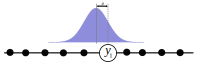
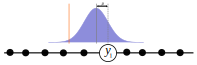
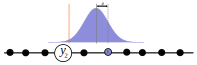
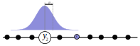
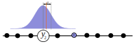
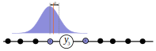
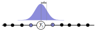
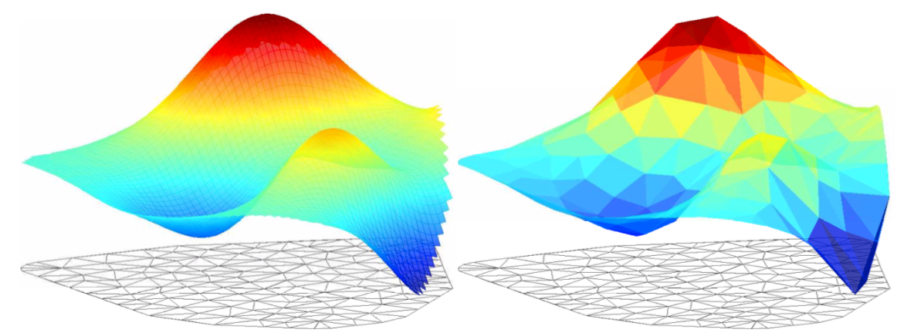

class: title-slide, middle

</img>
</img>

# Integrated nested Laplace Approximation (INLA)

.instructors[
  GSFE01 - F. Guillaume Blanchet & Steve Vissault
]


---
class: inverse, center, middle


```{r setup, include=FALSE}
options(htmltools.dir.version = FALSE)
library(INLA)
```


# Bayesian inference

<html><div style='float:left'></div><hr color='#EB811B' size=1px width=720px></html> 

---

# Frequentist

So far, all the techniques we used the frequentist paradigm when inferring results from data.

Frequentists want to find the best model parameter(s) for the data at hand

.Large[$$\text{Likelihood}\hspace{1.5cm}P(\text{Data}|\text{Model})$$]

They are interested in **maximizing** the .blue[Likelihood]

They need **data**

## Estimating model parameters

- Minimizing the sums of squares
- Simulated annealing
- Nelder-Mead Simplex
- ...

---

# Bayesian

Bayesians want to find how good the model parameter(s) are given some data

.Large[$$\text{Posterior}\hspace{1.5cm}P(\text{Model}|\text{Data})$$]

They are interested in the .orange[posterior] distribution

They need **data** and **prior** information

The general framework used in Bayesian modelling is 

$$\underbrace{P(\text{Model}|\text{Data})}_\text{Posterior}\propto \underbrace{P(\text{Data}|\text{Model})}_\text{Likelihood}\underbrace{P(\text{Model})}_\text{Prior}$$

### Estimating model parameters

- Markov Chain Monte Carlo
- INLA
- ...

---

# Our way of thinking is Bayesian


[](https://www.youtube.com/watch?v=g5G7PE_sKGg?t=37)


---
class: inverse, center, middle


# Integrated Nested Laplace Approximation

<html><div style='float:left'></div><hr color='#EB811B' size=1px width=720px></html> 

---

# INLA

INLA is an efficient way to estimate Bayesian model parameters.

To understand how INLA works, we need to learn about:
- Latent Gaussian models

To understand how to use INLA for spatial and spatiotemporal models, we need to also learn about:
- Gaussian Markov Random Fields

So... A lot of rather complex mathematics is ahead of us...

Let's jump in !

---
class: inverse, center, middle


# Latent Gaussian models

<html><div style='float:left'></div><hr color='#EB811B' size=1px width=720px></html> 

---

# Conceptual representation

Latent Gaussian models are a form of hierarchical model with three levels 

```{r echo=FALSE, fig.align='center', out.width="90%"}

```

---

# How it works

## Using multiple regression as an example

A special case of a latent Gaussian model is multiple regression, which is commonly presented as follow:

$$y_i = \beta_jX_{ij} + \varepsilon_i$$
where
- $y_i$ is the value of a response variable sampled at site $i$ out of $n$
- $X_{ij}$ is the value of the $j^\text{th}$ explanatory variable out of $p$ sampled at site $i$
- $\beta_j$ is the regression parameter associated to the $j^\text{th}$ explanatory variable
- $\varepsilon_i$ is the model error at site $i$. This is assumed to follow a Gaussian distribution

---

# How it works

## Using multiple regression as an example

### Likelihood model

The likelihood function for our multiple regression (assuming a Gaussian error) can be written as

$$\mathbf{y} | \mathbf{X}, \boldsymbol{\beta},\sigma^2 \sim \prod_{i=1}^n \frac{1}{\sqrt{2\pi\sigma^2}} e^{-\frac{(y_i - \beta X_i)^2}{2\sigma^2}}$$

where
- $y_i$ is the value of a response variable sampled at site $i$
- $\mathbf{X}_{i}$ are the values of all explanatory variables sampled at site $i$
- $\boldsymbol{\beta}$ is a vector of regression parameters for all explanatory variables
- $\sigma^2$ is the variance of the Gaussian distribution underlying the model

---

# How it works

## Using multiple regression as an example

### Latent field

In our multiple regression, the latent field is 

$$\mathbf{X}, \boldsymbol{\beta}|\boldsymbol{\theta} \sim N(0,\mathbf{\Sigma}(\boldsymbol{\theta}))$$
where
- $\mathbf{\Sigma}$ is a covariance matrix
- $\boldsymbol{\theta}$ is a hyperparameter that influence the structure of the covariance matrix $\mathbf{\Sigma}$. This could be a spatial/temporal constraint.

This is a key to Latent Gaussian field. That is for a model to be a **Latent Gaussian model** it is .red[essential] that

$$\beta\sim N(0,\mathbf{\Sigma}(\boldsymbol{\theta}))$$

---

# How it works

## Using multiple regression as an example

### Hyperparameters

.small[
The hyperparameters are parameters unrelated to the Gaussian distribution from which the regression parameters are derived. As was seen in the conceptual representation of the latent Gaussian model, there are two types of hyperparameters

- Hyperparameters associated to the likelihood
  - Variance ( $\sigma^2$ in our multiple regression)
  - Overdispersion (e.g. Negative binomial model)
  - Scale (e.g. Gamma model)
  - ...
- Hyperparameters associated to the Latent field
  - Variance constraints
  - Spatial/temporal correlation
  - Autoregressive coefficients
  - ...
]

---

# .footnotesize[General aspects of latent Gaussian models]

.small[
Latent Gaussian models are not limited to multiple regression model, they are a framework that emcompasses 
- Generalized linear models
- Generalized linear mixed models
- Generalized additive models
- Generalized additive mixed models
- Spatial and temporal correlated effect
- Latent variable models

In this respect, in `INLA` the multiple regression we wrote as 

$$y_i = \beta_jX_{ij} + \varepsilon_i$$

is presented as

$$y_i = \mathbf{A}\mathbf{X}_i + \varepsilon_i$$
where  $\mathbf{A}$ is general notation that represents an *observation matrix* which includes a sets of parameters used to model $\mathbf{y}$.
]

---

# Estimating latent Gaussian model

.small[
We will discuss three ways to estimate latent Gaussian model
1. Gaussian approximation
2. Laplace approximation
3. Simplified Laplace approximation

INLA is designed to estimate a *latent Gaussian model* to learn about its:
- Parameters
  - Regression coefficients
- Hyperparameters
  - Correlation in an autoregressive model
  - Variance of a random effect

Simplified Laplace approximation is the default estimation procedure in INLA, which can be understood through a brief overview of
- Gaussian approximation 
- Laplace approximation
]

---

# Gaussian approximation

## Using multiple regression as an example

In a Gaussian approximation we assume that 
$$\mathbf{X}, \boldsymbol{\beta}_j|\boldsymbol{\theta}_k, \mathbf{y} \sim N(\mu_j(\boldsymbol{\theta}),\sigma_j^2(\boldsymbol{\theta}))$$
where
- the mean $\mu_j(\boldsymbol{\theta})$
- the marginal variance $\sigma_j^2(\boldsymbol{\theta})$
are estimated through a careful use of the Gaussian Markov random field

--

This approach is very fast (Yééé !) 

--

But... the assumptions are too strong and often results in poor estimation (Bouh !) 

---

# Laplace approximation

## Using multiple regression as an example

Let's suppose that the distribution of $\boldsymbol{\beta}_j$ looks like 

```{r, echo = FALSE, fig.align='center', fig.width=12, fig.height=4}
x <- seq(-10,25, length.out = 500)
y <- dgamma(x, 5,1)
plot(x,y, type = "n",
     axes = FALSE,
     xlab = "", ylab = "")
abline(h = 0, col = "lightgrey", lwd = 5)
lines(x,y, lwd = 5)
```

A Laplace approximation can estimate the distribution of any unimodal distribution through a clever use of Gaussian approximation. 

In other words, Laplace approximation can be conceptually understood as a "weighted" Gaussian approximation.

---

# Laplace approximation

## Using multiple regression as an example

.small[If we look at the probability distribution of a Gaussian distribution]
.pull-left[
```{r, echo = FALSE, fig.align='center', fig.width=6, fig.height=3}
x <- seq(-10,10, length.out = 500)
y <- dnorm(x, 0,2)
plot(x,y, type = "n",
     axes = FALSE,
     xlab = "", ylab = "")
abline(h = 0, col = "lightgrey", lwd = 5)
lines(x,y, lwd = 5, col = "orange")
```
]
.pull-right[
$$\frac{1}{\sqrt{2\pi\sigma^2}} e^{-\frac{(y - \mu)^2}{2\sigma^2}}$$
]

.small[
There are two parameters associated to the Gaussian distribution
- $\mu$ :  The **mean** of the Gaussian distribution
- $\sigma^2$ :  The **variance** of the Gaussian distribution

The Laplace approximation's is designed to finds the best **mean** and **variance** values of a Gaussian distribution to fit a the distribution associated to $\boldsymbol\beta_j$.
]

---

# Laplace approximation

## Using multiple regression as an example

Visually, The difference between the $\boldsymbol\beta_j$ and its Laplace approximation looks like
```{r, echo = FALSE, fig.align='center', fig.width=12, fig.height=4}
x <- seq(-10,25, length.out = 500)
y <- dgamma(x, 5,1)
LALog <- (log(1/24) + 4 * log(4) -4) - ((x - 4)^2 / (2 * 1/(4/(4^2))))
par(mar = c(5,5,0.5,0.5))
plot(x,y, type = "n",
     axes = FALSE,
     xlab = "", ylab = expression(italic(beta[j])),
     cex.lab = 2)
abline(h = 0,col = "lightgrey", lwd = 5)

axis(2, las =2)
lines(x,y, lwd = 5)
lines(x, exp(LALog), lwd = 5, col = "orange")
legend("topright",
       lty = 1,
       lwd = 5, 
       legend = c(expression(italic(beta[j])), "Laplace approximation"),
       col = c("black", "orange"),
       cex = 1.4)
```
**Advantage** : More precise than a Gaussian approximation (it handles skewness much better)

**Disadvantage**: Slow (Bouh!)

---
# Simplified Laplace approximation

*Simplified Laplace approximation* was proposed by Rue et al. (2009) and is designed to use the best out of Gaussian approximation and Laplace approximation. 

Specifically, *simplified Laplace approximation* is
- Computationally .Large[very] fast
- Almost as precise as Laplace approximation

The theoretical developpement underlying simplified Laplace approximation is beyond the scope of this course, in essence it includes a series of smart tricks. 


---

# Generalities about INLA
.small[
Integrated Nested Laplace Approximation (INLA) has a number of interesting properties:
- It is to be used within a Bayesian framework
  - This means that **priors** need to be chosen and a likelihood needs to be calculated
- The type of models estimated are **all** variant of a **latent Gaussian model**
  - This is a very broad group of modelss
- INLA is a parameter (and hyperparameter) estimation procedure (nothing more, nothing less)
- It is an approximation, so it is not perfect... However, it does works most of the time
- Compare to classic estimation approaches it is *blisteringly* fast

The last few slides present a very (!) general overview of the theory behind INLA.

If you want to know more about how INLA works, take a look at [http://www.r-inla.org](http://www.r-inla.org)
]

---

# How fast is INLA ?

The most commonly used approach to estimate Bayesian models is Markov Chain Monte Carlo (MCMC).

JAGS is the most commonly used software to implement various types of Bayesian models. 

Let's compare JAGS and INLA to estimate the parameters and hyperparameter of a linear model
$$y = \alpha + \beta x$$
where $\beta \sim N(0,\sigma^2)$

In this model the parameters to estimate are 
- $\alpha$
- $\beta$
- $\sigma^2$

---

# How fast is INLA ?

## Data Simulation 
```{r}
N <- 500
x <- rnorm(N, mean=6,sd=2)
y <- rnorm(N, mean=x,sd=1) 
dat <- list(x=x,y=y,N=N)
```
---

# How fast is INLA ?

### JAGS code
.footnotesize[
```{r, message = FALSE, warning = FALSE, results = FALSE}
library(rjags)

cat('model{ 
  for(i in 1:N) {
    y[i] ~ dnorm(mu[i],tau)
    mu[i] <- alpha + beta*x[i] 
  }
  alpha  ~ dnorm(0,0.001)
  beta  ~ dnorm(0,0.001) 
  tau ~ dgamma(0.01,0.01) 
}', file = "JAGSmodel.txt")
JAGSmodel <- jags.model(file = "JAGSmodel.txt", data=dat,
                        n.chains=3, n.adapt = 5000)
params <- c("alpha","beta","tau","mu") 
```

```{r, eval=TRUE}
system.time(
resJAGS <- coda.samples(JAGSmodel, params, n.iter=50000 )
)
```
]

---

# How fast is INLA ?

### INLA code
```{r, message=FALSE, eval=TRUE}
library(INLA)

system.time(
resINLA <- inla(y~x,
            family = "gaussian",
            data = dat)
)
```

---

# How fast is INLA ?
## Do the results match

```{r, echo = FALSE, fig.width=12, eval=TRUE}
par(mfrow = c(1,2), mar = c(2,3,4,1))

plot(resINLA$marginals.fixed$`(Intercept)`,
     type = "n", xlab = "", ylab = "",
     main = expression(alpha), las = 1, cex.main = 4)
hist(resJAGS[[1]][,1], breaks = 100,
     freq = FALSE, add = TRUE, col = "lightblue", border = "white")
lines(resINLA$marginals.fixed$`(Intercept)`,
      lwd = 3, col = "darkblue")

legend("topright",
       legend = c("JAGS", "INLA"), 
       col = c("lightblue", "darkblue"),
       lty = c(1,1), lwd = c(6,3))

plot(resINLA$marginals.fixed$x,
     type = "n", xlab = "", ylab = "",
     main = expression(beta), las = 1, cex.main = 4)
hist(resJAGS[[1]][,2], breaks = 100,
     freq = FALSE, add = TRUE, col = "orange", border = "white")
lines(resINLA$marginals.fixed$x,
      lwd = 3, col = "brown")

legend("topright",
       legend = c("JAGS", "INLA"), 
       col = c("orange", "brown"),
       lty = c(1,1), lwd = c(6,3))
```

---
class: inverse, center, middle


# Spatial and spatiotemporal modelling using INLA

<html><div style='float:left'></div><hr color='#EB811B' size=1px width=720px></html> 

---
# .small[Why use INLA for space(-time) modelling?]

Spatial modelling is computationnally intensive.

When the number of samples becomes largeish, the traditional ways of estimating spatial models falls apart especially when making spatial interpolation. 

Specifically, computation time increases exponentially as the number of samples increases.

Using INLA, it is possible to bypass some of the time consuming procedures and, as such, we can construct accurate spatial and spatiotemporal models even with a very large number of samples.


---

# Space(-time) modelling using INLA

As mentionned earlier, to understand how to use INLA for spatial and spatiotemporal models, we need to also learn about:
- Gaussian Markov Random Fields

Actually, knowing about *Gaussian Markov Random Fields* is technically important for the basic INLA algorithm but we skimmed over it earlier, however now we need to look into it in more details.

---
class: inverse, center, middle


# Gaussian Markov Random Field

<html><div style='float:left'></div><hr color='#EB811B' size=1px width=720px></html> 

---

# Conceptual representation

Gaussian Markov Random Field can be illustrated using the following transect

```{r echo=FALSE, fig.align='center', out.width="90%"}

```

---

# Conceptual representation

Gaussian Markov Random Field can be illustrated using the following transect

```{r echo=FALSE, fig.align='center', out.width="90%"}

```

---

# Conceptual representation

Gaussian Markov Random Field can be illustrated using the following transect

```{r echo=FALSE, fig.align='center', out.width="90%"}

```
---

# Conceptual representation

Gaussian Markov Random Field can be illustrated using the following transect

```{r echo=FALSE, fig.align='center', out.width="90%"}

```
---

# Conceptual representation

Gaussian Markov Random Field can be illustrated using the following transect

```{r echo=FALSE, fig.align='center', out.width="90%"}

```
---

# Conceptual representation

Gaussian Markov Random Field can be illustrated using the following transect

```{r echo=FALSE, fig.align='center', out.width="90%"}

```

---

# Conceptual representation

Gaussian Markov Random Field can be illustrated using the following transect

```{r echo=FALSE, fig.align='center', out.width="90%"}

```

---

# Conceptual representation

Gaussian Markov Random Field can be illustrated using the following transect

```{r echo=FALSE, fig.align='center', out.width="90%"}

```

## Property of Gaussian Markov Random Field
- A stochastic process relying on the Gaussian distribution
- A memoryless process that depends only on the present to decide the next outcome, not the events that occured in the past

---

# .small[Conceptual representation in 2D]

```{r, echo = FALSE, fig.align="center", eval=TRUE}
set.seed(42)
loc <- matrix(runif(10*2),10,2)

mesh <- inla.mesh.create(loc,refine=list(max.edge=0.1))

par(mar = c(0,0,0,0))
plot(mesh, main = "")
pointSel<-which(mesh$loc[,1] > 0.38 & mesh$loc[,1] < 0.62 &
                mesh$loc[,2] > 0.57 & mesh$loc[,2] < 0.83)

points(mesh$loc[pointSel[14],1],
       mesh$loc[pointSel[14],2],
       col = "black", cex = 2, pch = 19)

points(mesh$loc[pointSel[c(1,4,7,8,13 ,19:21)],1],
       mesh$loc[pointSel[c(1,4,7,8,13 ,19:21)],2],
       col = "blue", cex = 2, pch = 19)

points(mesh$loc[pointSel[-c(1,4,7,8,13,14,19:21)],1],
       mesh$loc[pointSel[-c(1,4,7,8,13,14,19:21)],2],
       col = "turquoise", cex = 2, pch = 19)
```

---


# .scriptsize[Mathematics of Gaussian Markov Random Field]
.small[
A Gaussian Markov random field $\mathbf{y}$ is defined as

$$\mathbf{y}\sim N(\mathbf{\mu}, \mathbf{\Sigma})$$
which satisfies 
$$p(y_i | \{y_j: i\ne j\}) = p(y_i | \{y_j: j \in \mathcal{N}_i\})$$
where $\mathcal{N}$ is the neigbourhood around sample $i$
]

## A trick about Gaussian Markov random field

.small[
When defining a Gaussian Markov random field above, we relied on the covariance matrix $\mathbf{\Sigma}$. 

Another way to present Gaussian Markov random field is to rely on precision $(\mathbf{Q})$.

Precision is the inverse of covariance. This can be formalized as
$$\mathbf{\Sigma} = \mathbf{Q}^{-1}$$
]

---

# Why should we rely on $\mathbf{Q}$ and not $\mathbf{\Sigma}$? 

.small[
What has been known for a while is that when $y_i$ and $y_j$ are uncorrelated, their covariance is 0. Mathematically, this can be written as 

$$y_i \perp y_j \Leftrightarrow \mathbf{\Sigma}_{ij} = 0$$

What Rue et al. (2009) showed is that conditional on $\mathbf{y}_{-ij}$ (a shorthand for $y_j : i\ne j$), when $y_i$ and $y_j$ are uncorrelated, their precision is 0. Mathematically, this can be written as 

$$y_i \perp y_j | \mathbf{y}_{-ij} \Leftrightarrow \mathbf{Q}_{ij} = 0$$
This discovery by Rue et al. (2009) is especially useful because the resulting precision matrix $\mathbf{Q}$ only has non-zero values for neighbours and diagonal elements. It is thus a **sparse matrix**, making it much easier to invert (a necessary procedure when estimating models).

*Note*: Computationally, inverting a matrix is challenging especially when the matrix is large and dense. However, the more zeros a matrix has the easier it gets to invert. 
]
---
# Constructing $\mathbf{Q}$

.small[
As you now know, in geostatistical context, the semivariogram serves as reference to make interpolations. 

Through some fancy theoretical work by Lindgren et al. (2011) relying on *stochastic partial differential equation* we learned that a well suited model to derive a good precision matrix $\mathbf{Q}$ is the Matérn covariance model
]

.pull-left[
.small[
$$\gamma(\boldsymbol{h}) = \frac{\sigma^2}{2^{\nu-1}\Gamma(\nu)}\left(\kappa \boldsymbol{h}\right)^\nu K_\nu\left(\kappa \boldsymbol{h}\right)$$
where
- $\boldsymbol{h}$ is the distance between two samples
- $\sigma^2$ is the variance
- $\nu$ and $\kappa$ are scaling parameters (always $> 0$)
- $K_\nu$ is a Bessel function of the second kind of order $\nu$
]
]
.pull-right[
```{r, echo = FALSE, message=FALSE, warning=FALSE, fig.height=6.5}
library(gstat)
res <- show.vgms(kappa.range = c( .5, 2, 5, 10),
          max = 15, plot = FALSE)
par(mfrow = c(2,2), mar = c(1,1,1,1), oma = c(3,3,3,0))
plot(res[1:50,2:1], 
     type = "l", 
     lwd = 3,
     col = "blue",
     xaxt = "n",
     yaxt = "n")
legend("bottomright",
       legend = expression(paste(kappa,"= 0.5")),
       cex = 2)

plot(res[51:100,2:1], 
     type = "l", 
     lwd = 3,
     col = "blue",
     xaxt = "n",
     yaxt = "n")
legend("bottomright",
       legend = expression(paste(kappa,"= 2")),
       cex = 2)

plot(res[101:150,2:1], 
     type = "l", 
     lwd = 3,
     col = "blue",
     xaxt = "n",
     yaxt = "n")
legend("bottomright",
       legend = expression(paste(kappa,"= 5")),
       cex = 2)

plot(res[151:200,2:1], 
     type = "l", 
     lwd = 3,
     col = "blue",
     xaxt = "n",
     yaxt = "n")
legend("bottomright",
       legend = expression(paste(kappa,"= 10")),
       cex = 2)

mtext("Distance", side = 1, cex = 2, outer = TRUE)
mtext("Variance", side = 2, cex = 2, outer = TRUE)
mtext("Matérn model", side = 3, cex = 2.5, outer = TRUE)
```
]

---

# Constructing $\mathbf{Q}$

.footnotesize[
Discrete approximation of the Matérn covariance model can be constructed using weighted basis functions.

Concretly, we can decide on a mesh underlying the study area to approximate the Matérn covariance model and as such the precision matrix $\mathbf{Q}$

We can thus visually see the difference between the INLA approach and the classical approach
]
.pull-left[
## Classic
]
.pull-right[
## INLA
]

```{r echo=FALSE, fig.align='center', out.width="90%"}

```

---
# Constructing the mesh

What we want is a mesh that looks like this
```{r, echo = FALSE, fig.align="center", eval = TRUE, fig.height=5, fig.width=5}
set.seed(42)
loc <- matrix(runif(50*2),50,2)

mesh <- inla.mesh.2d(loc.domain = loc,
                     max.edge = 0.1,
                     offset = c(0.1,0.3))

par(mar = c(0,0,0,0))
plot(mesh, main = "")
points(loc, pch = 19, col = "blue", cex = 2)
```

---
# Constructing the mesh
## Property of a good mesh

- The samples do **not** need to be at the corner of edges
- Triangles formed in the mesh are roughly of the same size
- The number of vertex (points in the mesh) is reasonable
- There should be a buffer around the points 

### Important technical consideration
In INLA, estimation is performed at each point of the mesh and the interpolation is made between each vertex with an approach akin to a regression.

---

# Constructing the mesh
## A few example of bad mesh

You should be careful about a mesh that looks like this
```{r, echo = FALSE, fig.align="center", eval = TRUE, fig.height=5, fig.width=5}
mesh <- inla.mesh.2d(loc.domain = loc,
                     max.edge = 0.02,
                     offset = 0.2)

par(mar = c(0,0,0,0))
plot(mesh, main = "")
points(loc, pch = 19, col = "blue", cex = 2)
```
It is not wrong, but it will take longer to estimate

---

# Constructing the mesh
## A few example of bad mesh

You should be careful about a mesh that looks like this
```{r, echo = FALSE, fig.align="center", eval = TRUE, fig.height=5, fig.width=5}
mesh <- inla.mesh.2d(loc.domain = loc,
                     max.edge = 0.5,
                     offset = 0.2)

par(mar = c(0,0,0,0))
plot(mesh, main = "")
points(loc, pch = 19, col = "blue", cex = 2)
```
It is not wrong, but it will give a very (!) coarse interpolation

---

# Constructing the mesh
## A few example of bad mesh

Mesh like this should not use! 
```{r, echo = FALSE, fig.align="center", eval = TRUE, fig.height=5, fig.width=5}
mesh <- inla.mesh.2d(loc.domain = loc,
                     max.edge = c(0.3,0.5),
                     offset = c(0.05,0.3),n =4)

par(mar = c(0,0,0,0))
plot(mesh, main = "")
points(loc, pch = 19, col = "blue", cex = 2)
```
The triangles are very different in size.

