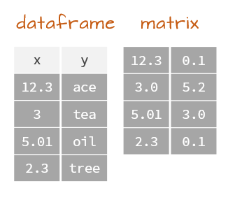
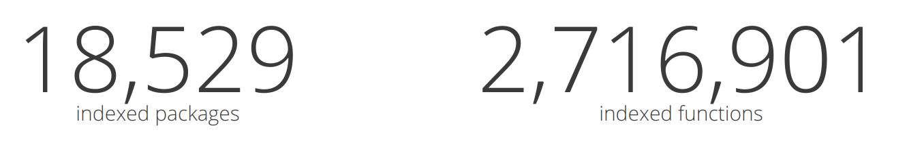
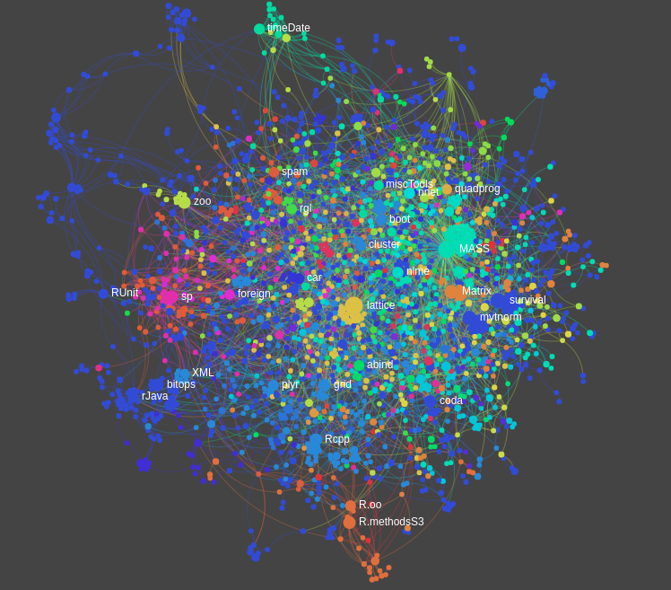
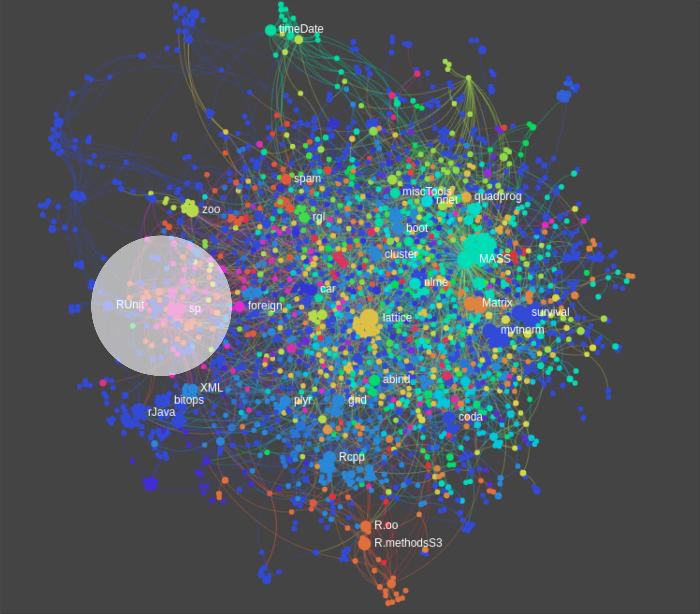
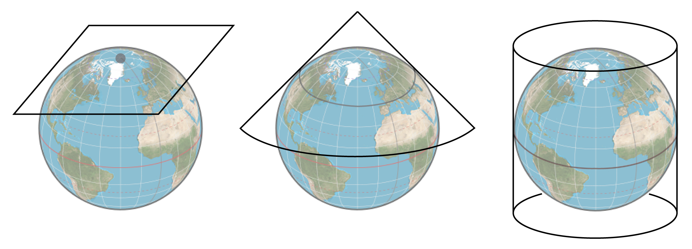
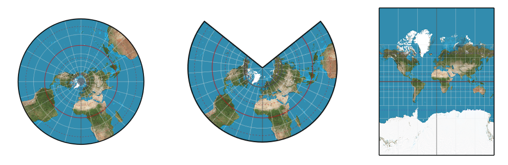
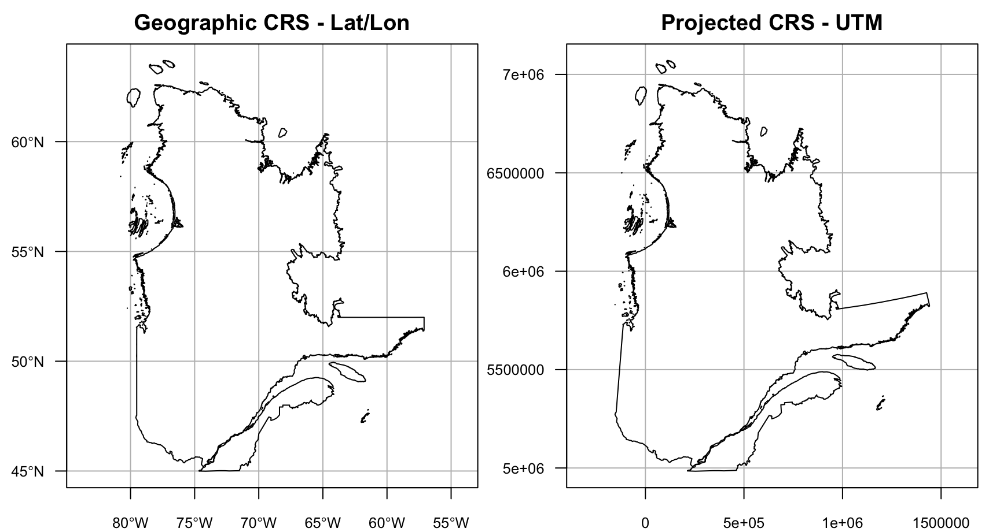
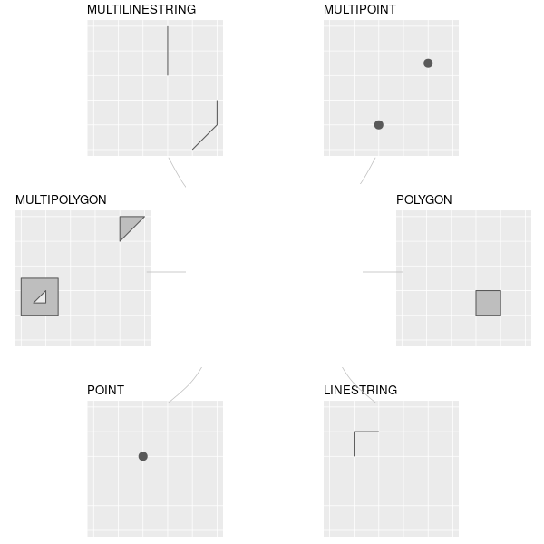
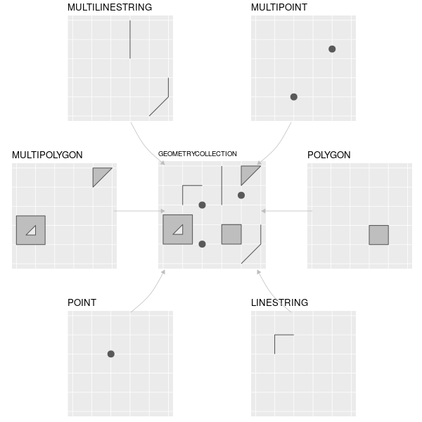

class: title-slide, middle

</img>
</img>

# Handling Spatial and Spatio-temporal data Using R

.instructors[
  GSFE01 - F. Guillaume Blanchet & Steve Vissault
]

```{r setup, include=FALSE}
options(htmltools.dir.version = FALSE)
```


---
class: middle, clear

# Objectives

1. Brief overview of basics R instructions (30 minutes)
2. Handle spatial data in R (2 hours)
3. Manipulate and explore spatio-temporal data in R (2 hours)

---
class: inverse, center, middle

# Review basic R instructions

<html><div style='float:left'></div><hr color='#EB811B' size=1px width=720px></html> 

---

# R basics

## Object assignation

Code in the black area

```{r, eval = FALSE}
x <- 3 
x
```

Output starting with `##`

```{r, echo = FALSE}
x <- 3 
x
```

`x` is an object whichin we assign (`<-`) a numerical value of `3`

---

# R basics

R can be used as a calculator

```{r}
1.2 + -0.654 * 32
```

Values stored in the R environment (through objects) can be reused 

```{r}
y <- x + -0.654 * 32
y
```

---

# Logical operators

### Several options

```
x == y # equal
x != y # not equal
x < y # smaller than
x >= y # greater than or equal
```

### Example

```{r}
x == y
# Return logical values TRUE / FALSE
```

---
class: inverse, center, middle

# Vector

<html><div style='float:left'></div><hr color='#EB811B' size=1px width=720px></html> 

---

# Vector

### Vector declaration

```{r}
x <- c("a", "b", "c")
x

# Other way with numerical values
1:3
```
--

### Can we mixed type of values (ex. numeric with text)?

```r
x <- c("a",1,2)
```

--

Yes, but the entire vector will be convert as string vector

---

# Vector position

### Accessing specific position in vector

```{r}
x <- c("a", "b", "c")
x[1]
x[c(2,1)]
```

---

# Vector manipulations

### Assigning ot removing items in the array

```{r}
x[1] <- "z"
x
x[-c(2,1)]
```

### Vector algebra

```{r}
3 * c(11,22,33)
```

---

# Vector

Special values

```{r}
c(NA, 1/0, 0/0)
```


---
class: inverse, center, middle

# Matrix

<html><div style='float:left'></div><hr color='#EB811B' size=1px width=720px></html> 


---

# Matrix

### Matrix declaration

```{r}
m <- matrix(20:23,nrow=2,ncol=2)
m
```

### Accessing specific positions in matrix

```{r results = "hold"}
m[1,]
m[,2]
m[1,2]
```

---

# Matrix algebra

```{r}
m <- matrix(c(1,1,1,1),nrow=2,ncol=2)
m
3 * m
```

---

# Different columns type

### Can we have two columns type within a matrix?

```{r}
matrix(c("a","b",2, 1),nrow=2,ncol=2)
```

Same as for a vector, the entire matrix will be coerce into string/text type. 

--

.pull-left[
 So, how can we achieve two columns with different types?
]

--

.pull-right[
```{r echo=FALSE, out.width="60%", fig.align='center'}

```
]

---
class: inverse, center, middle

# Dataframe

<html><div style='float:left'></div><hr color='#EB811B' size=1px width=720px></html> 

---

# Dataframe

Table generated by combining several vectors of any type (text, date,
numeric etc.). 

```{r}
df <- data.frame(
  col_text = c("cat","dog","parrot","guinea pig"),
  col_date = as.Date(c("2019-11-12","2019-11-11","2019-11-10","2019-11-09")),
  col_numerical = c(11,22,33,44),
  stringsAsFactors = FALSE
)
```

```{r}
df
```

---

# Dataframe

### Accessing specific element

```{r}
# Row
df[1,]
# Column
df[,1]
# Position
df[1,1]
```

---

# Dataframe

### Accessing specific columns

```{r}
df[,c("col_text","col_date")]
df$col_date
```

---
class: inverse, center, middle

# Wrap up

<html><div style='float:left'></div><hr color='#EB811B' size=1px width=720px></html> 


---

# Wrap up

### Different object types

```{r echo=FALSE, out.width="60%", fig.align='center'}
knitr::include_graphics("./assets/img/data_structures.png")
```

.font70[
  From https://mgimond.github.io/ES218/Week02a.html
]

---

# R basics

### Functions

.pull-left[
```{r}
Add <- function(x, y) {
  return(x + y)
}

Add(10, 3)
```
]

.pull-right[

```{r echo=FALSE, out.width="40%", fig.align='center'}
knitr::include_graphics("https://qcbsrworkshops.github.io/workshop01/workshop01-en/images/function_V2_en.png")
```

]


---
class: clear, middle

# R Universe

R contains a **plethora of packages**. Each package expose a set of functions. 

```{r echo=FALSE, out.width="80%", fig.align='center'}

```

From https://www.rdocumentation.org/trends

---
class: clear, middle

# Interact with the R universe

```{r, eval = FALSE}
# Install distant packages
install.packages("vegan")
# Then access to a specific function
vegan::decostand()
# Or load the entire package
library(vegan)
```


---
class: clear, middle

# Navigate in the R universe

Search in the documentation

https://www.rdocumentation.org/ or https://rdrr.io/

Search or get help on specific functions

```{r, eval = FALSE}
?plot # Search within your loaded packages
??raster # Search among packages (loaded and unloaded)
```

---
class: clear, middle, center

# R Universe


```{r echo=FALSE, out.width="65%", fig.align='center'}

```

---
class: clear, middle, center

# Spatial galaxy


```{r echo=FALSE, out.width="65%", fig.align='center'}

```


---
class: inverse, center, middle


# Spatial galaxy

<html><div style='float:left'></div><hr color='#EB811B' size=1px width=720px></html> 


---
class: clear, middle

# What's coming next?

1. Overview of spatial objects
2. Manipulate spatial vectors (POINT, LINE, POLYGON)
3. Manipulate rasters   
4. Spatial operations
5. Export geographical objects

---
class: inverse, center, middle


# Overview of spatial objects

<html><div style='float:left'></div><hr color='#EB811B' size=1px width=720px></html> 

---
class: middle, clear

# Spatial vector

```{r echo=FALSE, out.width="100%", fig.align='center'}
knitr::include_graphics("./assets/img/vectors.png")
```

---
class: middle, clear

# Rasters

```{r echo=FALSE, out.width="100%", fig.align='center'}
knitr::include_graphics("./assets/img/raster.png")
```

---
class: inverse, center, middle


# Coordinate Reference System (CRS)

<html><div style='float:left'></div><hr color='#EB811B' size=1px width=720px></html> 

---

# Coordinate Reference System (CRS) 

Projections are defined as coordinate reference system (CRS)

### Geographic (or unprojected) CRS

```{r echo=FALSE, out.width="60%", fig.align='center'}

```

### Projected CRS

```{r echo=FALSE, out.width="60%", fig.align='center'}

```

---

# Coordinate Reference System (CRS)

### Geographic (or unprojected) CRS

- Latitude and longitude, i.e. angles measured from the Earth’s center to a point on the Earth’s surface
- 3-D representation of Earth (sphere or ellipsoid)
- Distance in geographic CRSs are therefore measured in degrees, not meters
- Lon/Lat locate any points on Earth’s surface, but are not uniform units of measure

### Projected CRS

- Uses Cartesian coordinates, Easting and Northing (x and y) **typically in meters**
- 2-D representation of Earth
- All projected CRSs are based on a geographic CRS
- Different mathematical formulas (i.e. projections) can transform the 3-D globe to a 2-D map

---

# Geographic vs projected CRS

```{r echo=FALSE, out.width="80%", fig.align='center'}

```

Representation not very different at regional scale, BUT very important if you want to conduct spatial analysis (e.g. euclidean distances among points)

---

# Coordinate Reference System (CRS) 

- Each CRS has a spatial reference ID called SRID or EPSG
- In R, the notation used to describe the CRS is proj4string
from the PROJ.4 library. It looks like this:

`+init=epsg:4326 +proj=longlat +ellps=WGS84 +datum=WGS84 +no_defs`

When you know the EPSG/SRID of the projection, the `proj4string` can be found using R functions.

Some examples, but details coming later in the day.

- `rgdal::CRS("+init=epsg:4326")`
- `sp::CRS("+init=epsg:4326")`
- `sf::st_crs(4326)`


---

# Coordinate Reference System (CRS)

To search for a specific CRS, have a look at [spatialreference.org](https://spatialreference.org/)

exemple: https://spatialreference.org/ref/epsg/4326/

[Overview of Coordinate Reference Systems (CRS)](https://www.nceas.ucsb.edu/~frazier/RSpatialGuides/OverviewCoordinateReferenceSystems.pdf)


---
class: inverse, center, middle

# Manipulate spatial vectors

<html><div style='float:left'></div><hr color='#EB811B' size=1px width=720px></html> 

Points, Lines & Polygons

---
class: middle, clear

# R packages for spatial vectors

- `sp` package provides classes and methods for dealing with spatial data. 
- `sf` is a newer package now on CRAN, and is being
actively developed here: sf, providing Simple Features for R, in compliance with
the OGC Simple Feature standard. 


---
class: inverse, center, middle

# Why `sf`?

<html><div style='float:left'></div><hr color='#EB811B' size=1px width=720px></html> 

---

# Why sf?

Why use the `sf` package when `sp` is already tried and tested?

1. Simple features refers to a formal standard (ISO 19125-1:2004) that describes how objects in the real world can be represented in computers 
2. Successor of sp
3. `sf` incorporates the functionality of the 3 main packages of the sp paradigm in a single, cohesive whole:
  - sp for the class system;
  - rgdal for reading and writing data;
  - rgeos for spatial operations undertaken by GEOS.

Instead of learning 3 packages, we focus on only one.

---

# Why sf?

- sf objects are easy to manipulate: spatial objects are stored as data frames, with the feature geometries stored in list-columns

```{r echo=FALSE, out.width="70%", fig.align='center'}
knitr::include_graphics("https://user-images.githubusercontent.com/520851/50280460-e35c1880-044c-11e9-9ed7-cc46754e49db.jpg")
```

.font70[
  Illustration from [Allison Horst](https://twitter.com/allison_horst/status/1071456081308614656)
]

---
# Structure of `sf` object

```{r echo=FALSE, out.width="100%", fig.align='center'}
knitr::include_graphics("./assets/img/str_sf.png")
```

---

# `sfg` - Simple feature geometry 

```{r echo=FALSE, out.width="70%", fig.align='center'}

```

---

# `sfg` - Simple feature geometry 

```{r echo=FALSE, out.width="70%", fig.align='center'}

```

---
class: inverse, center, middle

# Creating simple feature

<html><div style='float:left'></div><hr color='#EB811B' size=1px width=720px></html> 


---
# Points

Declare spatial points (same as .shp file)
```{r}
library(sf) # Do not forget to load the library

ottawa <- st_point(c(-75.69812, 45.41117))
sherbrooke <- st_point(c(-71.89908, 45.40008))
winnipeg <- st_point(c(-97.14704, 49.8844))
calgary <- st_point(c(-114.08529, 51.05011))
vancouver <- st_point(c(-123.11934, 49.24966))
```

Set all points in spatial column and the 4326 CRS (WGS84)

```{r}
cities <- st_sfc(
            list(ottawa, sherbrooke, winnipeg, calgary, vancouver), 
            crs = 4326
          )
class(cities)
```

---
# Declare attributes

```{r}
# Declare attribute table (same as .dbf file)
attr_table <- data.frame(
  N = c(1236324, 212105, 804200, 1406700, 2463431),
  name = c("Ottawa","Sherbrooke","Winnipeg","Calgary","Vancouver")
)
attr_table
```

---
# Declare CRS

```{r}
# Find approriate projection
proj <- st_crs(4326)
proj
```

---
# Attach attributes table and CRS

```{r}
# Attach spatial feature, attribute table
great_cities <- st_sf(attr_table, geom = cities, crs = proj)
great_cities
```

---
# Visual check

```{r, fig.height = 4, fig.width = 6, fig.align="center", fig.retina = 2}
plot(great_cities[,"N"])
```

---
# Visual check

```{r, out.height='65%', out.width='100%'}
library(mapview)
mapview(great_cities, zoom = 1)
```


--

What about spatial lines and polygons?

---
# Lines

Declaring lines and polygons are getting complex if you have fine details (more points).


```{r, fig.height = 4, fig.width = 4, fig.align="center", fig.retina = 2}
# line composed of 3 coordinates
line <- st_linestring(rbind(c(0,0),c(1,1),c(2,1)))

# Visualise
plot(line, col = "red", lwd=2)
plot(st_cast(line,"MULTIPOINT"), pch = 19, add = TRUE)
```

---
# Polygons

Declaring lines and polygons are getting complex if you have fine details (more points).

```{r, fig.height = 4, fig.width = 4, fig.align="center", fig.retina = 2}
outer = matrix(c(0,0,10,0,10,10,0,10,0,0),ncol=2, byrow=TRUE)
hole1 = matrix(c(1,1,1,2,2,2,2,1,1,1),ncol=2, byrow=TRUE)
hole2 = matrix(c(5,5,5,6,6,6,6,5,5,5),ncol=2, byrow=TRUE)
pts = list(outer, hole1, hole2)
poly <- st_polygon(pts)

plot(poly, col = "red")


```

--

This is why we usually import spatial data from shapefiles (lines & polygons) and CSV (points).

---
class: inverse, center, middle

# Importing and exporting simple features

<html><div style='float:left'></div><hr color='#EB811B' size=1px width=720px></html> 

---
# Importing simple features from CSV

```{r}
ca_cities <- read.csv("https://simplemaps.com/static/data/country-cities/ca/ca.csv")
head(ca_cities, 4)
```

--

How to make it spatial?
We need to know 3 basics informations: latitude (`lat`), longitude (`lng`), the CRS.

---
# Importing simple features from CSV

```{r out.height='65%', out.width='100%'}
sf_cities <- st_as_sf(ca_cities, coords = c("lng", "lat"), crs = 4326)
sf_cities
```

And it's done.

---
# Supported files format

`sf` offers a large number of drivers 

```{r}
st_drivers(what = "vector")[,1]
```

---
# Importing features from Shapefiles

Simple exemple from the Community Aquatic Monitoring Program (CAMP) for the Southern Gulf of St. Lawrence
([Open Data](https://open.canada.ca/data/en/dataset/c4474517-3d9b-e581-a6e2-e95273f2058e))

```{r}

```

---
# Importing features from GeoDataBase

Simple exemple from the Community Aquatic Monitoring Program (CAMP) for the Southern Gulf of St. Lawrence
([Open Data](https://open.canada.ca/data/en/dataset/c4474517-3d9b-e581-a6e2-e95273f2058e))

```{r}
st_layers("assets/data/camp_station_summary_eng.gdb")
stations <- st_read("assets/data/camp_station_summary_eng.gdb",
                    layer = "camp_station_summary_eng")
```

---
# Importing features from GeoDataBase

Simple exemple from the Community Aquatic Monitoring Program (CAMP) for the Southern Gulf of St. Lawrence
([Open Data](https://open.canada.ca/data/en/dataset/c4474517-3d9b-e581-a6e2-e95273f2058e))


```{r, echo = FALSE, out.height='50%', out.width='100%'}
mapview(stations)
```

---
class: inverse, center, middle

# Manipulating spatial features

<html><div style='float:left'></div><hr color='#EB811B' size=1px width=720px></html> 

---
# Subsetting features

https://r-spatial.github.io/sf/articles/sf4.html

---
# Removing features

https://r-spatial.github.io/sf/articles/sf4.html

---
# Transform CRS

https://r-spatial.github.io/sf/articles/sf4.html


---
# Let's practice (20 minutes)

EXERCICE TODO
1. Import shapefile 
2. Select based on criteria (ex. size of the pop)
3. 

???
# Vector
- Import from csv and shapefiles
  - Données Canada (click)
- Reprojections
- Crop 
- Buffers
# Raster
- Resampling (optionnal)
# Raster avec vectors
- Exercice Interception raster avec points et Polygons
- Crop / mask 
- 

---
class: inverse, center, middle

# Raster: gridded spatial data

---
class: inverse, center, middle


# Spatio-temporal data

<html><div style='float:left'></div><hr color='#EB811B' size=1px width=720px></html> 

