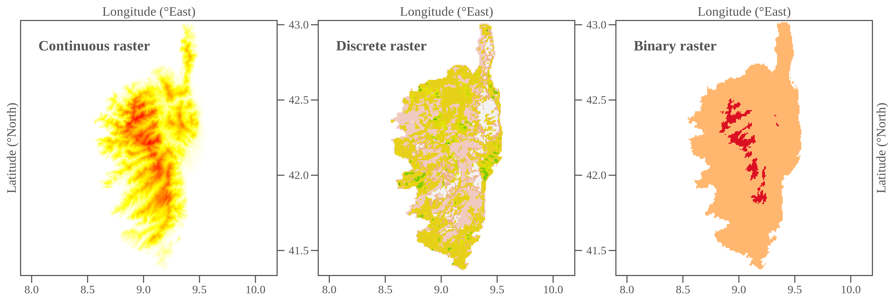

class: title-slide, middle

</img>
</img>

# Handling spatial data with R

.instructors[
  GSFE01 - F. Guillaume Blanchet & Steve Vissault
]

```{r setup, include=FALSE}
options(htmltools.dir.version = FALSE)
```

---
class: clear, center, middle

## Slides available:
https://steveviss.github.io/PR-GSFE01/basics

## Solutions of all exercises:
https://steveviss.github.io/PR-GSFE01/basics/practice.html

---
class: inverse, center, middle

# Review basic R instructions

<html><div style='float:left'></div><hr color='#EB811B' size=1px width=720px></html> 

---

# R basics

## Object assignation

Code in the black area

```{r, eval = FALSE}
x <- 3 
x
```

Output starting with `##`

```{r, echo = FALSE}
x <- 3 
x
```

`x` is an object whichin we assign (`<-`) a numerical value of `3`

---

# R basics

R can be used as a calculator

```{r}
1.2 + -0.654 * 32
```

Values stored in the R environment (through objects) can be reused 

```{r}
y <- x + -0.654 * 32
y
```

---

# Logical operators

### Several options

```
x == y # equal
x != y # not equal
x < y # smaller than
x >= y # greater than or equal
```

### Example

```{r}
x == y
# Return logical values TRUE / FALSE
```

---
class: inverse, center, middle

# Vector

<html><div style='float:left'></div><hr color='#EB811B' size=1px width=720px></html> 

---

# Vector

### Vector declaration

```{r}
x <- c("a", "b", "c")
x

# Other way with numerical values
1:3
```
--

### Can we mixed type of values (ex. numeric with text)?

```r
x <- c("a",1,2)
```

--

Yes, but the entire vector will be convert as a character string vector

---

# Vector position

### Accessing specific position in vector

```{r}
x <- c("a", "b", "c")
x[1]
x[c(2,1)]
```

---

# Vector manipulations

### Assigning or removing items in the array

```{r}
x[1] <- "z"
x
x[-c(2,1)]
```

### Vector algebra

```{r}
3 * c(11,22,33)
```

---

# Vector

Special values

```{r}
c(NA, 1/0, 0/0)
```


---
class: inverse, center, middle

# Matrix

<html><div style='float:left'></div><hr color='#EB811B' size=1px width=720px></html> 


---

# Matrix

### Matrix declaration

```{r}
m <- matrix(20:23,nrow=2,ncol=2)
m
```

### Accessing specific positions in matrix

```{r results = "hold"}
m[1,]
m[,2]
m[1,2]
```

---

# Matrix algebra

```{r}
m <- matrix(c(1,1,2,2,3,3),nrow=3,ncol=2)
m
m %*% t(m)
```

---

# Different columns type

### Can we have two columns type within a matrix?

```{r}
matrix(c("a","b",2, 1),nrow=2,ncol=2)
```

Same as for a vector, the entire matrix will be coerce into character string. 

--

.pull-left[
 So, how can we get a table with two columns with different types of information?
]

--

.pull-right[
```{r echo=FALSE, out.width="60%", fig.align='center'}
knitr::include_graphics("./assets/img/data_structures2.png")
```
]

---
class: inverse, center, middle

# Dataframe

<html><div style='float:left'></div><hr color='#EB811B' size=1px width=720px></html> 

---

# Dataframe

Table generated by combining several vectors of any type (text, date,
numeric etc.)

```{r}
df <- data.frame(
  col_text = c("cat","dog","parrot","guinea pig"),
  col_date = as.Date(c("2019-11-12","2019-11-11","2019-11-10","2019-11-09")),
  col_numerical = c(11,22,33,44),
  stringsAsFactors = FALSE
)
```

```{r}
df
```

---

# Dataframe

### Accessing specific element

```{r}
# Row
df[1,]
# Column
df[,1]
# Position
df[1,1]
```


---

# Dataframe

### Accessing specific columns

```{r}
df[,c("col_text","col_date")]
df$col_date
```

--

With dataframe, all columns have to have the same length. 

Want more flexibility : `list()`. 

---
class: inverse, center, middle

# List

<html><div style='float:left'></div><hr color='#EB811B' size=1px width=720px></html> 


---

# List

A list store collections of objects (single value, vector or matrix).

```{r}
l <- list(
  v = c(1,2,3,4),
  m = matrix(c(1,1,1,1),nrow=2,ncol=2)
)
```
```{r}
l
```

---

# List

```{r}
l <- list(
  v = c(1,2,3,4),
  m = matrix(c(1,1,1,1),nrow=2,ncol=2)
)
```
```{r results="hold"}
l$v
#equivalent: l[['v']]
```

---

# List

```{r}
l <- list(
  v = c(1,2,3,4),
  m = matrix(c(1,1,1,1),nrow=2,ncol=2)
)
```
```{r results="hold"}
l$m 
#equivalent: l[['m']]
```

---

# List

```{r}
l <- list(
  v = c(1,2,3,4),
  m = matrix(c(1,1,1,1),nrow=2,ncol=2)
)
```

```{r}
l$v[2]
```


---
class: inverse, center, middle

# Wrap up

<html><div style='float:left'></div><hr color='#EB811B' size=1px width=720px></html> 


---

# Wrap up

### Different object types

```{r echo=FALSE, out.width="60%", fig.align='center'}
knitr::include_graphics("./assets/img/data_structures.png")
```

.font70[
  From https://mgimond.github.io/ES218/Week02a.html
]


---

# R basics

### Functions

.pull-left[
```{r}
Add <- function(x, y) {
  return(x + y)
}

Add(10, 3)
```
]

.pull-right[

```{r echo=FALSE, out.width="40%", fig.align='center'}
knitr::include_graphics("https://qcbsrworkshops.github.io/workshop01/workshop01-en/images/function_V2_en.png")
```

]


---
class: clear, middle

# R Universe

R contains a **plethora of packages**. Each package expose a set of functions. 

```{r echo=FALSE, out.width="80%", fig.align='center'}

```

From https://www.rdocumentation.org/trends

---
class: clear, middle

# Interact with the R universe

```{r, eval = FALSE}
# Install packages
install.packages("sf")
# Then access to a specific function
sf::st_crop()
# Or load the entire package
library(sf)
```


---
class: clear, middle

# Navigate in the R universe

Search in the documentation

https://www.rdocumentation.org/ or https://rdrr.io/

Search or get help on specific functions

```{r, eval = FALSE}
?plot # Search within your loaded packages
??raster # Search among packages (loaded and unloaded)
```

---
class: clear, middle, center

# R Universe


```{r echo=FALSE, out.width="65%", fig.align='center'}

```

---
class: clear, middle, center

# Spatial galaxy


```{r echo=FALSE, out.width="65%", fig.align='center'}
knitr::include_graphics("./assets/img/cloud-packages-zoomin.png")
```


---
class: inverse, center, middle


# Spatial galaxy

<html><div style='float:left'></div><hr color='#EB811B' size=1px width=720px></html> 


---
class: clear, middle

# What's coming next?

1. Overview of spatial objects
2. Manipulate spatial vectors (POINT, LINE, POLYGON)
4. Spatial operations on vectors
5. Rasters manipulations   
6. Spatial operations on rasters

---
class: inverse, center, middle


# Overview of spatial objects

<html><div style='float:left'></div><hr color='#EB811B' size=1px width=720px></html> 

---
class: middle, clear

# Spatial vector

```{r echo=FALSE, out.width="100%", fig.align='center'}
knitr::include_graphics("./assets/img/vectors.png")
```

---
class: middle, clear

# Rasters

```{r echo=FALSE, out.width="100%", fig.align='center'}

```

---
class: inverse, center, middle


# Coordinate Reference System (CRS)

<html><div style='float:left'></div><hr color='#EB811B' size=1px width=720px></html> 

---

# Coordinate Reference System (CRS) 

Projections are defined as coordinate reference system (CRS)

### Geographic (or unprojected) CRS

```{r echo=FALSE, out.width="60%", fig.align='center'}

```

### Projected CRS

```{r echo=FALSE, out.width="60%", fig.align='center'}
knitr::include_graphics("./assets/img/projection2.png")
```

---

# Coordinate Reference System (CRS)

### Geographic (or unprojected) CRS

- Latitude and longitude, i.e. angles measured from the Earth’s center to a point on the Earth’s surface
- 3-D representation of Earth (sphere or ellipsoid)
- Distance in geographic CRSs are therefore measured in degrees, not meters
- Lon/Lat locate any points on Earth’s surface, but are not uniform units of measure

### Projected CRS

- Uses Cartesian coordinates, Easting and Northing (x and y) **typically in meters**
- 2-D representation of Earth
- All projected CRSs are based on a geographic CRS
- Different mathematical formulas (i.e. projections) can transform the 3-D globe to a 2-D map

---

# Geographic vs projected CRS

```{r echo=FALSE, out.width="80%", fig.align='center'}

```

The representation may not be very different at fine spatial scale, **but it is very different at broader spatial scales.**

---

# Coordinate Reference System (CRS) 

- Each CRS has a spatial reference ID called SRID or EPSG
- In R, the notation used to describe the CRS is **proj4string**
from the PROJ.4 library. It looks like this:

`+init=epsg:4326 +proj=longlat +ellps=WGS84 +datum=WGS84 +no_defs`

Knowing the EPSG/SRID of the projection can thus become handy. Luckily, there are very good resources on the web for this.

To search for a specific CRS, have a look at [spatialreference.org](https://spatialreference.org/)

exemple: https://spatialreference.org/ref/epsg/4326/

[Overview of Coordinate Reference Systems (CRS)](https://www.nceas.ucsb.edu/~frazier/RSpatialGuides/OverviewCoordinateReferenceSystems.pdf)

---

# Coordinate Reference System (CRS)

There are also R functions designed to use this information to convert EPSG/SRID for R objects

- `rgdal::CRS("+init=epsg:4326")`
- `sp::CRS("+init=epsg:4326")`
- `sf::st_crs(4326)`


---
class: inverse, center, middle

# Manipulate spatial vectors

<html><div style='float:left'></div><hr color='#EB811B' size=1px width=720px></html> 

Points, Lines & Polygons

---
class: middle, clear

# R packages for spatial vectors

- `sp` package provides classes and methods for dealing with spatial data. 
- `maptools` & `rgeos` packages give access to functions to manipulate and analyze spatial vectors
- `sf` is newer. It provides Simple Features for R, in compliance with
the [Open Geospatial Consortium](https://www.opengeospatial.org/) (OGC) Simple Feature standard. 

--

In this course, we will focus mainly on `sf`.

---
class: inverse, center, middle

# Why `sf`?

<html><div style='float:left'></div><hr color='#EB811B' size=1px width=720px></html> 

---

# Why sf?

Why use the `sf` package when `sp` is already tried and tested?

1. Simple features refers to a formal standard (ISO 19125-1:2004) that describes how objects in the real world can be represented in computers 
2. Successor of `sp`
3. `sf` incorporates the functionality of the 3 mai spatial data manipulation packages in a single, cohesive whole:
  - `sp` for the class system;
  - `rgdal` for reading and writing data;
  - `rgeos` for spatial operations undertaken by GEOS.

So, instead of learning 3 packages, we focus only on one.

---

# Why sf?

- `sf` objects are easy to manipulate: spatial objects are stored as data frames, with the feature geometries stored in list-columns

```{r echo=FALSE, out.width="70%", fig.align='center'}
knitr::include_graphics("https://user-images.githubusercontent.com/520851/50280460-e35c1880-044c-11e9-9ed7-cc46754e49db.jpg")
```

.font70[
  Illustration from [Allison Horst](https://twitter.com/allison_horst/status/1071456081308614656)
]

---
# Structure of `sf` object

```{r echo=FALSE, out.width="100%", fig.align='center'}
knitr::include_graphics("./assets/img/str_sf.png")
```

---

# `sfg` - Simple feature geometry 

```{r echo=FALSE, out.width="70%", fig.align='center'}

```

---

# `sfg` - Simple feature geometry 

```{r echo=FALSE, out.width="70%", fig.align='center'}
knitr::include_graphics("./assets/img/sf2.png")
```

---
class: inverse, center, middle

# Creating simple feature

<html><div style='float:left'></div><hr color='#EB811B' size=1px width=720px></html> 


---
# Points

Declare spatial vertices / points (same as .shp file)
```{r}
library(sf) # Do not forget to load the library

ottawa <- st_point(c(-75.69812, 45.41117))
sherbrooke <- st_point(c(-71.89908, 45.40008))
winnipeg <- st_point(c(-97.14704, 49.8844))
calgary <- st_point(c(-114.08529, 51.05011))
vancouver <- st_point(c(-123.11934, 49.24966))
```

Set all points in spatial column and the 4326 CRS (WGS84)

```{r}
cities <- st_sfc(
            list(ottawa, sherbrooke, winnipeg, calgary, vancouver), 
            crs = 4326
          )
class(cities)
```

---
# Declare attributes

```{r}
# Declare attribute table (same as .dbf file)
attr_table <- data.frame(
  N = c(1236324, 212105, 804200, 1406700, 2463431),
  name = c("Ottawa","Sherbrooke","Winnipeg","Calgary","Vancouver")
)
attr_table
```

---
# Declare CRS

```{r}
# Find approriate projection
proj <- st_crs(4326)
proj
```

---
# Attach attributes table and CRS

```{r}
# Attach spatial feature, attribute table
great_cities <- st_sf(attr_table, geom = cities, crs = proj)
great_cities
```

---
# Visual check

```{r, fig.height = 4, fig.width = 6, fig.align="center", fig.retina = 2}
plot(great_cities[,"N"])
```

---
# Visual check

```{r, out.height='65%', out.width='100%'}
library(mapview)
mapview(great_cities, zoom = 1)
```

--

What about spatial lines and polygons?

---
# Lines

Declaring lines and polygons may become complex if you want to account for fine details.


```{r, fig.height = 4, fig.width = 4, fig.align="center", fig.retina = 2}
# Example of line composed of 3 coordinates
line <- st_linestring(rbind(c(0,0),c(1,1),c(2,1)))
class(line)

# Visualise
plot(line, col = "red", lwd=2)
plot(st_cast(line,"MULTIPOINT"), pch = 19, add = TRUE)
```

---
# Polygons

Declaring lines and polygons may become complex, when accounting for fine details.

```{r, fig.height = 3, fig.width = 3, fig.align="center", fig.retina = 2}
outer = matrix(c(0,0,10,0,10,10,0,10,0,0),ncol=2, byrow=TRUE)
hole1 = matrix(c(1,1,1,2,2,2,2,1,1,1),ncol=2, byrow=TRUE)
hole2 = matrix(c(5,5,5,6,6,6,6,5,5,5),ncol=2, byrow=TRUE)
pts = list(outer, hole1, hole2)
poly <- st_polygon(pts)

plot(poly, col = "red")
```

--

This is why we usually import them from shapefiles (lines & polygons) and CSV (points).

---
class: inverse, center, middle

# Importing and exporting simple features

<html><div style='float:left'></div><hr color='#EB811B' size=1px width=720px></html> 

---
# Importing simple points features from CSV

```{r}
ca_cities <- read.csv("https://simplemaps.com/static/data/country-cities/ca/ca.csv")
head(ca_cities, 4)
```

--

How to make it spatial?
We need to know 3 basics informations: 
- Latitude (`lat`)
- Longitude (`lng`), 
- Projection (i.e. the CRS)

Unfortunately, projection (the CRS) is often hidden somewhere in the CSV file metadata.

---
# Importing simple features from CSV

```{r out.height='65%', out.width='100%'}
sf_ca_cities_wgs84 <- st_as_sf(ca_cities, coords = c("lng", "lat"), crs = 4326)
sf_ca_cities_wgs84
```

And it's done.

---
# Importing features from files

`sf` can read a large number of spatial vector formats. This is possible because
of the hardwork of the OGC organisation developing international standards.

The first 50 formats

```{r}
st_drivers(what = "vector")[1:50,1]
```


---
# Importing features from ESRI shapefiles

Let's download the world coastlines shapefile (available [here](https://www.naturalearthdata.com/http//www.naturalearthdata.com/download/10m/physical/ne_10m_coastline.zip)) 

```{r}
# download the data 
download.file("http://www.naturalearthdata.com/http//www.naturalearthdata.com/download/10m/physical/ne_10m_coastline.zip", 
              destfile = 'assets/data/coastlines.zip')

# unzip the file
unzip(zipfile = "assets/data/coastlines.zip", 
      exdir = 'assets/data/ne-coastlines-10m')

# WARNING: You have to define you own path in destfile argument and exdir.
```


---
# Importing features from ESRI shapefiles

```{r}
dir('assets/data/ne-coastlines-10m')
```

### Valid ESRI shapefiles

- `.shp`: The main file that stores the feature geometry (required).
- `.shx`: The index file that stores the index of the feature geometry (required).
- `.dbf`: The dBASE table that stores the attribute information of features (required).
- `.prj`: The file that stores the coordinate system information (used by ArcGIS).

---
# Importing features from ESRI shapefiles

```{r, fig.align = 'center', fig.height = 4, fig.width = 6, fig.align='center'}
coast <- st_read('assets/data/ne-coastlines-10m')
par(mar=rep(0,4))
plot(st_geometry(coast))
```

---
# Importing features from GeoDataBase

Simple exemple from the Community Aquatic Monitoring Program (CAMP) for the Southern Gulf of St. Lawrence
(Download from [open.canada.ca](https://open.canada.ca/data/en/dataset/c4474517-3d9b-e581-a6e2-e95273f2058e))

```{r}
st_layers("assets/data/camp_station_summary_eng.gdb")
stations <- st_read("assets/data/camp_station_summary_eng.gdb",
                    layer = "camp_station_summary_eng")
```

---
# Importing features from GeoDataBase

Simple exemple from the Community Aquatic Monitoring Program (CAMP) for the Southern Gulf of St. Lawrence
(Download from [open.canada.ca](https://open.canada.ca/data/en/dataset/c4474517-3d9b-e581-a6e2-e95273f2058e))


```{r, echo = FALSE, out.height='50%', out.width='100%'}
mapview(stations)
```

---
# Export spatial vectors

We go back to the coastline object and want to extract the St. Lawrence Gulf.
First, we draw the polygon of the area of interest (using http://arthur-e.github.io/Wicket/sandbox-gmaps3.html).

```{r, warnings = FALSE}
area <- st_as_sfc("POLYGON((-71.19219092922373 51.818174659518405,-55.06426124172373 51.818174659518405,-55.06426124172373 45.47097576656452,-71.19219092922373 45.47097576656452,-71.19219092922373 51.818174659518405))")
# This is a WKT representation of the polygon, often used on the web, 
# a quick way to define a polygon
area <- st_set_crs(area, 4326)
cropped_coast <- st_crop(coast,area)
```

---
# Export spatial vectors

```{r, fig.align='center'}
# Visual representation
par(mar=rep(0,4))
plot(st_geometry(cropped_coast))
```

---
# Export spatial vectors

Then, we save the new cropped spatial feature to an ESRI shapefile on the computer.

```{r, eval = FALSE}
st_write(cropped_coast, dsn = "assets/data/cropped_coast", driver = "ESRI Shapefile")
```

---
class: clear, middle

# `r icon::fa("gamepad")` Practice

1. Download the [coastline shapefile](https://www.naturalearthdata.com/http//www.naturalearthdata.com/download/10m/physical/ne_10m_coastline.zip) on your own computer.
2. Read the shapefile with the `st_read()` function.

If you want, you can try with your own data or download other shapefiles from https://www.naturalearthdata.com/

---
class: inverse, center, middle

# Manipulating spatial features with `sf`

<html><div style='float:left'></div><hr color='#EB811B' size=1px width=720px></html> 

---
# Filtering based on data attributes

Select cities in Manitoba

```{r, out.height='75%', out.width='100%'}
mb_cities <- subset(sf_ca_cities_wgs84, admin == 'Manitoba')
mapview(mb_cities)
```

---
# Select a spatial feature

```{r}
# Select the first feature
mb_cities[1,]
```

---
# Remove spatial features 

```{r}
# Remove the first 5 features
mb_cities[-c(1:5),]
```

---
# Transform CRS

Change the original projection from WGS84 (SRID 4326) to NAD83 / Statistics Canada Lambert (SRID 3347). 

```{r}
sf_ca_cities_nad83 <- st_transform(sf_ca_cities_wgs84, 3347)
sf_ca_cities_nad83
```

---
# Create buffers around cities

Create buffer of 10 kms around cities. This will transform sf_ca_cities_nad83
from POINT to POLYGONS.

```{r, out.width = "100%", out.height = "55%"}
buf_10K_cities <- st_buffer(sf_ca_cities_nad83, 10000)
mapview(buf_10K_cities)
```

And so many spatial operations that we cannot cover all of them...

---
# Spatial operations with `sf`

```{r echo=FALSE, out.width="85%", fig.align='center'}

```

[Download `sf` cheat sheet](https://github.com/rstudio/cheatsheets/blob/master/sf.pdf)

---
class: clear, middle

# `r icon::fa("gamepad")` Practice

1. Download and read with `sf` the [canadian cities CSV file](https://simplemaps.com/static/data/country-cities/ca/ca.csv).
2. Select all cities from your province
3. Select the 10 most populated cities in your province

---
class: inverse, center, middle

# Rasters manipulation

<html><div style='float:left'></div><hr color='#EB811B' size=1px width=720px></html> 


---

# Gridded spatial data

Gridded spatial data is a special case that need to be handle with the library `raster`.

```{r echo=FALSE, out.width="90%", fig.align='center'}
knitr::include_graphics("./assets/img/raster_pic.png")
```
136 raster formats supported by GDAL library (and hence by R). 

---
# Diversity of formats


.pull-left[
**Some examples**

*Classic gridded format*
```
GTiff: GeoTIFF
XYZ: ASCII Gridded XYZ
```

*Images*
```
PNG: Portable Network Graphics
JPEG: JPEG JFIF
```

*Multibands (often related to satellite imaging)*
```
netCDF: Network Common Data Format
HDF4: Hierarchical Data Format Release 4
```
]

.pull-right[
```{r echo=FALSE, out.width="100%", fig.align='center'}
knitr::include_graphics("./assets/img/rgb.jpeg")
```
]


---
# Load raster from file

We simply use the function `raster()` to import the file in R.

```{r}
library(raster)
ocean_bottom <- raster("assets/data/OB_LR/OB_LR.tif")
ocean_bottom
```

---
# Load raster from file

```{r, fig.height=8, fig.width=12, fig.align='center'}
image(ocean_bottom)
```

---

# Retrieving free GIS data with `getData`

The function `getData` in the raster package allows to freely and quickly retrieve free GIS data such as:

- **GADM** - global administrative boundaries at different level of administrative subdivision
- **worldclim** - global interpolated climate data
- **alt** and STRM - coarse and fine resolution elevation data
- **ISO3** - 3 letter ISO codes for country names.

```{r}
# alt90 <- getData('SRTM', lon = -73.7, lat = 45.5) # Fine resolution
altCAN <- getData(name = "alt", country = "CAN", path = "assets/data") # Coarse resolution
altCAN
```

---
# Retrieving free GIS data with `getData`

```{r, fig.width = 12, fig.height=7, fig.align='center'}
plot(altCAN)
```

---
# Extract spatial values at specific locations

To interact with raster object, we have to convert the `sf_ca_cities_wgs84` containing the canadian cities.

```{r}
sf_ca_cities_wgs84$elev <- extract(altCAN,sf_ca_cities_wgs84) 
# return a vector of values with we can be attach to the sf object
sf_ca_cities_wgs84$elev
```
---

# Crop and mask rasters

`crop()` and `mask()` reduce object memory use and therefore computational time for raster manipulations.
`crop()` will decrease the extent of a raster, `mask()` will set to NA values outside a polygon boundary.

```{r, eval = FALSE}
# Get Quebec shapefile
can <- raster::getData("GADM", country = "CAN", level = 1, path = "assets/data")
# convert to sf
can <- st_as_sf(can)
# Subset Quebec
qc <- subset(can, NAME_1 == "Québec")

alt_qc <- crop(altCAN, qc) 
alt_mask <- mask(altCAN, qc)
```

```{r, echo = FALSE,eval = TRUE}
# Get Quebec shapefile
can <- raster::getData("GADM", country = "CAN", level = 1, path = "assets/data")
# convert to sf
can <- st_as_sf(can)
# Subset Quebec
qc <- subset(can, NAME_1 == "Québec")

alt_qc <- crop(altCAN, qc) 
#alt_mask <- mask(altCAN, qc)
```

---
# Crop and mask rasters

```{r, fig.align='center', fig.width=6, fig.height=6}
plot(alt_qc)
```

---
# Set new raster projection

We can use `projectRaster()` to transform the CRS of one spatial object to match another spatial object.

```{r, fig.width = 8, fig.height=5}
st_crs(sf_ca_cities_nad83)
alt_qc_nad83 <- projectRaster(alt_qc, crs="+proj=lcc +lat_1=49 +lat_2=77 
+lat_0=63.390675 +lon_0=-91.86666666666666 +x_0=6200000 +y_0=3000000 +ellps=GRS80 
+towgs84=0,0,0,0,0,0,0 +units=m +no_defs")
```
---

# Set new raster projection

We can use `projectRaster()` to transform the CRS of one spatial object to match another spatial object.

```{r, fig.width = 7, fig.height=7, fig.align = 'center'}
plot(alt_qc_nad83)
```

---

class: clear, middle

# `r icon::fa("gamepad")` Practice

1. Read with `sf` the [canadian cities CSV file](https://simplemaps.com/static/data/country-cities/ca/ca.csv).
2. Import with `getData` the canadian digital elevation model (elevation raster)
3. Project the elevation raster and the canadian cities in NAD83 (`raster::projectRaster()` & `sf::st_transform()`)
4. Make a buffer of 10 kms around each canadian cities (`sf::st_buffer()`)
5. Crop the elevation raster with those buffers (`sf::st_crop()`) and compute the mean per buffer

---
# Stacking rasters

Two possibilities: over variables or over time period.

```{r echo=FALSE, out.width="90%", fig.align='center'}
knitr::include_graphics("./assets/img/raster_pic.png")
```

???
Bricks vs Stacks

---

# Stacking rasters

Example from scratch

```{r}
library(raster)
# Create two empty rasters
rs_var1 <- raster(ncol=10, nrow=10)
rs_var2 <- raster(ncol=10, nrow=10)

# Fill both with random values
rs_var1[] <- runif(100)
rs_var2[] <- runif(100)

# Stack them
st_vars <- stack(rs_var1, rs_var2)
st_vars
```

---

# Coerce rasterstack or raster to dataframe

```{r}
as.data.frame(st_vars, xy = TRUE)
```


```{r, eval=FALSE}
as.data.frame(rs_var1, xy = TRUE)
```


---
# Basic arithmetics

### Some arithmetic operations

- Classic operators: `+`, `*`, `-` etc.
  - `rs_vars1 + rs_var2`
- sum:  `sum(st_vars)`
- mean: `mean(st_vars)`
- variance: `var(rs_var1)`
- covariance: `cov(rs_var1, rs_var2)`
- Frequecy values: `hist(rs_var1)`


---

# Great online resources 1/3

### Good tutorials for spatial data in R

- [Raster analysis in R](https://mgimond.github.io/megug2017/)
- [Geocomputation with R](https://geocompr.robinlovelace.net/intro.html)
- [Spatial data in R](https://github.com/Pakillo/R-GIS-tutorial/blob/master/R-GIS_tutorial.md)
- [Document par Nicolas Casajus (fr)](https://qcbs.ca/wiki/_media/gisonr.pdf)
- http://r-spatial.org/
- [Tutorial on datacamp](https://www.datacamp.com/courses/spatial-analysis-in-r-with-sf-and-raster)
- [R in space - Insileco](https://insileco.github.io/2018/04/14/r-in-space---a-series/)

### `sf` manipulations

- [sf vignette #4](https://cran.r-project.org/web/packages/sf/vignettes/sf4.html)
- [Geocomputation with R](https://geocompr.robinlovelace.net/attr.html)
- [Attribute manipulations](https://insileco.github.io/2018/04/09/r-in-space---attribute-manipulations/)
- [Tidy spatial data in R](http://strimas.com/r/tidy-sf/)

---

# Great online resources 2/3

### Maps in R

- [Introduction to visualising spatial data in R](https://cran.r-project.org/doc/contrib/intro-spatial-rl.pdf)
- [Geocomputation with R](https://geocompr.robinlovelace.net/adv-map.html)
- [choropleth](https://cengel.github.io/rspatial/4_Mapping.nb.html)
- [leaflet](https://rstudio.github.io/leaflet/)
- [Mapview](https://r-spatial.github.io/mapview/index.html)
- [tmap](https://cran.r-project.org/web/packages/tmap/vignettes/tmap-nutshell.html)
- [plotly](https://plot.ly/python/maps/)
- [Animated maps](https://insileco.github.io/2017/07/05/animations-in-r-time-series-of-erythemal-irradiance-in-the-st.-lawrence/)


---

# Great online resources 3/3

### Get free data

- [free data at country level](http://www.diva-gis.org/gdata)
- [Quebec free data](http://mffp.gouv.qc.ca/le-ministere/acces-aux-donnees-gratuites/)
- [sdmpredictors](https://cran.r-project.org/web/packages/sdmpredictors/index.html) access to many datasets in R
- [find more spatial data](https://freegisdata.rtwilson.com/)
- [create shapefile on line](http://geojson.io/)
- EPSG: [link1](http://spatialreference.org/); [link2](http://epsg.io/)