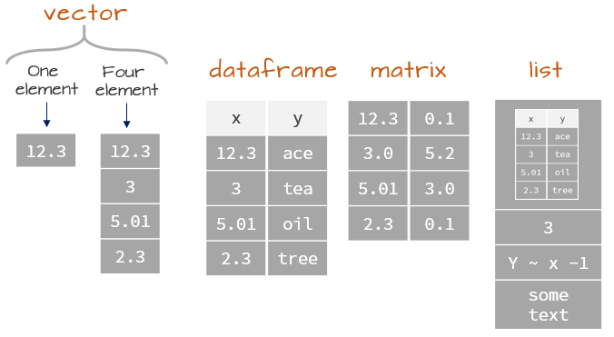

class: title-slide, middle

</img>
</img>

# Handling Spatial and Spatio-temporal data Using R

.instructors[
  GSFE01 - F. Guillaume Blanchet & Steve Vissault
]

```{r setup, include=FALSE}
options(htmltools.dir.version = FALSE)
```


---
class: middle, clear

# Objectives

1. Brief overview of basics R instructions (30 minutes)
2. Handle spatial data in R (2 hours)
3. Manipulate and explore spatio-temporal data in R (2 hours)

---
class: inverse, center, middle

# Review basic R instructions

<html><div style='float:left'></div><hr color='#EB811B' size=1px width=720px></html> 

---

# R basics

## Object assignation

Code in the black area

```{r, eval = FALSE}
x <- 3 
x
```

Output starting with `##`

```{r, echo = FALSE}
x <- 3 
x
```

`x` is an object whichin we assign (`<-`) a numerical value of `3`

---

# R basics

R can be used as a calculator

```{r}
1.2 + -0.654 * 32
```

Values stored in the R environment (through objects) can be reused 

```{r}
y <- x + -0.654 * 32
y
```

---

# Logical operators

### Several options

```
x == y # equal
x != y # not equal
x < y # smaller than
x >= y # greater than or equal
```

### Example

```{r}
x == y
# Return logical values TRUE / FALSE
```

---
class: inverse, center, middle

# Vectors

<html><div style='float:left'></div><hr color='#EB811B' size=1px width=720px></html> 

---

# Vectors

### Vector declaration

```{r}
x <- c("a", "b", "c")
x

# Other way with numerical values
1:3
```
--

### Can we mixed type of values (ex. numeric with text)?

```r
x <- c("a",1,2)
```

--

Yes, but the entire vector will be convert as string vector

---

# Vector positions

### Accessing specific positions in vector

```{r}
x <- c("a", "b", "c")
x[1]
x[c(2,1)]
```

---

# Vector manipulations

### Assigning ot removing items in the array

```{r}
x[1] <- "z"
x
x[-c(2,1)]
```

### Vector algebra

```{r}
3 * c(11,22,33)
```

---
class: inverse, center, middle

# Matrix

<html><div style='float:left'></div><hr color='#EB811B' size=1px width=720px></html> 


---

# Matrix

### Matrix declaration

```{r}
m <- matrix(20:23,nrow=2,ncol=2)
m
```

### Accessing specific positions in matrix

```{r results = "hold"}
m[1,]
m[,2]
m[1,2]
```

---

# Matrix algebra

```{r}
m <- matrix(c(1,1,1,1),nrow=2,ncol=2)
3 * m
```

---

# Different columns type

### Can we have two columns type within a matrix?

```{r}
matrix(c("a","b",2, 1),nrow=2,ncol=2)
```

Same as for a vector, the entire matrix will be coerce into string matrix. 

--

.pull-left[
 So, how can we achieve two columns with different types?
]

--

.pull-right[
```{r echo=FALSE, out.width="60%", fig.align='center'}

```
]

---
class: inverse, center, middle

# Dataframe

<html><div style='float:left'></div><hr color='#EB811B' size=1px width=720px></html> 

---

# Dataframe

2D object generated by combining several vectors of any type (text, date,
numeric etc.). Each column must be of the same type, but a dataframe may contain
columns of different types. Several statistical functions (e.g. regression) use
dataframes.

```{r}
l <- list(
  v = c(1,2,3,4),
  m = matrix(c(1,1,1,1),nrow=2,ncol=2)
)
```

```{r}
l$v[2]
```


---
class: inverse, center, middle

# List

<html><div style='float:left'></div><hr color='#EB811B' size=1px width=720px></html> 


---

# List

A list store collections of objects (single value, vector or matrix).

```{r}
l <- list(
  v = c(1,2,3,4),
  m = matrix(c(1,1,1,1),nrow=2,ncol=2)
)
```
```{r}
l
```

---

# List

```{r}
l <- list(
  v = c(1,2,3,4),
  m = matrix(c(1,1,1,1),nrow=2,ncol=2)
)
```
```{r results="hold"}
l$v
#equivalent: l[['v']]
```

---

# List

```{r}
l <- list(
  v = c(1,2,3,4),
  m = matrix(c(1,1,1,1),nrow=2,ncol=2)
)
```
```{r results="hold"}
l$m 
#equivalent: l[['m']]
```

---

# List

```{r}
l <- list(
  v = c(1,2,3,4),
  m = matrix(c(1,1,1,1),nrow=2,ncol=2)
)
```

```{r}
l$v[2]
```

---
class: inverse, center, middle

# Wrap up

<html><div style='float:left'></div><hr color='#EB811B' size=1px width=720px></html> 


---

# Wrap up

### Different object types

```{r echo=FALSE, out.width="60%", fig.align='center'}

```

.font70[
  From https://mgimond.github.io/ES218/Week02a.html
]

---

# R basics

### Functions

.pull-left[
```{r}
Add <- function(x, y) {
  return(x + y)
}

Add(10, 3)
```
]

.pull-right[

```{r echo=FALSE, out.width="40%", fig.align='center'}
knitr::include_graphics("https://qcbsrworkshops.github.io/workshop01/workshop01-en/images/function_V2_en.png")
```

]


---
class: clear, middle

# R Universe

R contains a **plethora of packages**. Each package expose a set of functions. 

```{r echo=FALSE, out.width="80%", fig.align='center'}
knitr::include_graphics("./assets/img/CRAN.png")
```

From https://www.rdocumentation.org/trends

---
class: clear, middle

# Interact with the R universe

```{r, eval = FALSE}
# Install distant packages
install.packages("vegan")
# Then access to a specific function
vegan::decostand()
# Or load the entire package
library(vegan)
```


---
class: clear, middle

# Navigate in the R universe

Search in the documentation

https://www.rdocumentation.org/ or https://rdrr.io/

Search or get help on specific functions

```{r, eval = FALSE}
?plot # Search within your loaded packages
??raster # Search among packages (loaded and unloaded)
```

---
class: clear, middle, center

# R Universe


```{r echo=FALSE, out.width="65%", fig.align='center'}
knitr::include_graphics("./assets/img/cloud-packages.png")
```

---
class: clear, middle, center

# Spatial galaxy


```{r echo=FALSE, out.width="65%", fig.align='center'}
knitr::include_graphics("./assets/img/cloud-packages-zoomin.png")
```


---
class: inverse, center, middle


# Spatial galaxy

<html><div style='float:left'></div><hr color='#EB811B' size=1px width=720px></html> 


---
class: clear, middle

# What's coming next?

1. Vector data
2. Rasters 
3. Coordinate Reference System (CRS) / Projections
4. Spatial operations
5. Export and import geographical objects
6. Maps visualisation 

---
class: inverse, center, middle


# Vector

<html><div style='float:left'></div><hr color='#EB811B' size=1px width=720px></html> 


---
class: inverse, center, middle


# Coordinate Reference System (CRS)

<html><div style='float:left'></div><hr color='#EB811B' size=1px width=720px></html> 

---

# Coordinate Reference System (CRS) 

Projections are defined as coordinate reference system (CRS)

### Geographic (or unprojected) CRS

```{r echo=FALSE, out.width="60%", fig.align='center'}
knitr::include_graphics("./assets/img/projection1.png")
```

### Projected CRS

```{r echo=FALSE, out.width="60%", fig.align='center'}
knitr::include_graphics("./assets/img/projection2.png")
```

---

# Coordinate Reference System (CRS)

### Geographic (or unprojected) CRS

- Latitude and longitude, i.e. angles measured from the Earth’s center to a point on the Earth’s surface
- 3-D representation of Earth (sphere or ellipsoid)
- Distance in geographic CRSs are therefore measured in degrees, not meters
- Lon/Lat locate any points on Earth’s surface, but are not uniform units of measure

### Projected CRS

- Uses Cartesian coordinates, Easting and Northing (x and y) typically in meters
- 2-D representation of Earth
- All projected CRSs are based on a geographic CRS
- Different mathematical formulas (i.e. projections) can transform the 3-D globe to a 2-D map

---

# Coordinate Reference System (CRS) 


- Each CRS has a spatial reference ID called SRID or EPSG
- In R, the notation used to describe the CRS is proj4string
from the PROJ.4 library. It looks like this:

`+init=epsg:4326 +proj=longlat +ellps=WGS84 +datum=WGS84 +no_defs`

When you know the EPSG/SRID of the projection, the `proj4string` can be found using the functions:

- `rgdal::CRS("+init=epsg:4326")`
- `sp::CRS("+init=epsg:4326")`
- `sf::st_crs(4326)`

---

# Coordinate Reference System (CRS)

To search for a specific CRS, have a look at [spatialreference.org](https://spatialreference.org/)

exemple: https://spatialreference.org/ref/epsg/4326/

[Overview of Coordinate Reference Systems (CRS)](https://www.nceas.ucsb.edu/~frazier/RSpatialGuides/OverviewCoordinateReferenceSystems.pdf)


---
class: inverse, center, middle


# Spatio-temporal data

<html><div style='float:left'></div><hr color='#EB811B' size=1px width=720px></html> 

