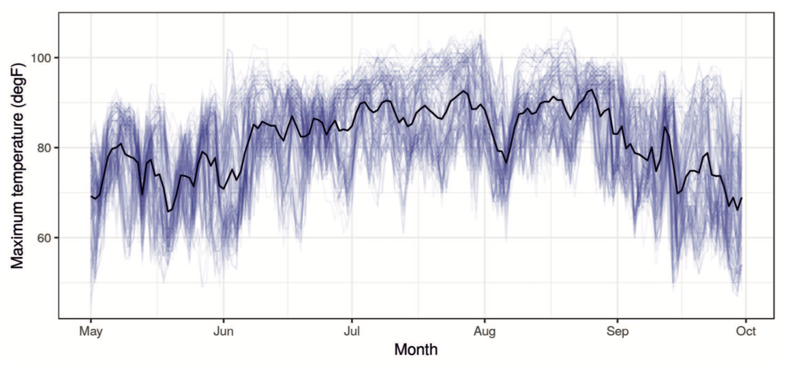
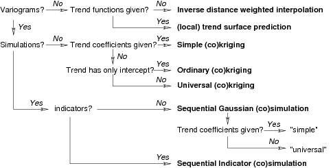

class: title-slide, middle


```{r setup, include=FALSE}
options(htmltools.dir.version = FALSE)
```

</img>
</img>

## Introduction

.instructors[
  GSFE01 - F. Guillaume Blanchet & Steve Vissault
]

---
class: inverse, center, middle

# The very basics

<html><div style='float:left'></div><hr color='#EB811B' size=1px width=720px></html> 

---

# Internet

## **Network : TheFortGarry**
## **Password : broadway**

---
class: clear, middle

# These slides

.Large[[https://steveviss.github.io/PR-GSFE01/intro](https://steveviss.github.io/PR-GSFE01/intro)]

---

# General daily schedule

.Large[
9h00 - Start of the day

9h00 to 12h00 - Lecture/Practice

12h00 to 13h00 - Lunch

13h00 to 17h00 - Lecture/Practice

**Note** During the "classroom" will be locked.
]
---

# General hotel stuff

.Large[
- Washroom
- Snacks
- Coffee
- ...
]

---
class: inverse, center, middle

# Let's start !

<html><div style='float:left'></div><hr color='#EB811B' size=1px width=720px></html> 

---

# Why do we sample?

A complete census is usually not practical. 

We can not sample very large areas or long time periods without:

- Lots of money/resources
- Extensive disturbance (e.g. soil samples)
- Violating assumptions (population closure for mobile species)

Therefore, we take a sample that (we hope!) is representative of the larger area, and use statistics to infer about the whole statistical population. 

---

# Sampling is not always easy

We need to get there (complete randomness might not be cost efficient).

Sometimes sample at the right time may be challenging (seasons, time-of-day).

Sometimes samples at the same location is nearly impossible (marine surveys).

---

# Space(-time) data

It comes in many form shape and sizes

## Vectorized data
```{r echo=FALSE, out.width="90%", fig.align='center'}
knitr::include_graphics("assets/img/vectors.png")
```

---

# Space(-time) data

It comes in many form shape and sizes

## Raster
```{r echo=FALSE, out.width="90%", fig.align='center'}
knitr::include_graphics("assets/img/raster.png")
```

---

# What is autocorrelations?
## Spatial autocorrelation

$$\textbf{Broad}\qquad\qquad\qquad \longrightarrow \qquad\qquad\qquad \textbf{Fine}$$
```{r echo=FALSE, out.width="90%", fig.align='center'}
knitr::include_graphics("https://journals.openedition.org/cybergeo/docannexe/image/27429/img-5-small480.jpg")
```

---
# What is autocorrelations?
## Temporal autocorrelation

```{r echo=FALSE, out.width="90%", fig.align='center'}

```

Maximum temperature (in Fahrenheit), from different weather stations (blue lines) of the United States of America National Oceanic and Atmospheric Administration (NOAA) and the empirical temporal mean  (black line). These data were gathered from May 1 1993 to September 30 1993.
---

#  Modelling space(-time) data

There are three groups of methods that are designed to account for spatial and spatiotemporal autocorrelation
- Autoregressive models
- Eigenbase spatial/temporal decompositions
- Geostatistics

For this course, we will focus on geostatistical models.

---

# What is geostatistics ?

Geostatistics is a branch of statistics designed to account for the **spatial**  and **spatiotemporal** covariance in data.

## How we will use this framework
- To account for spatial (and spatiotemporal) autocorrelation
- Better understand spatial (and spatiotemporal) systems
- Sample spatially (and spatiotemporally) constrained systems
- Interpolate over space (and time)
- Extrapolate over space (and time)

---

# A bit of history

The "geo" in geostatistics refers to **geology**.

## Historical figures

.pull-left[
**Daniel G. Krige**
```{r echo=FALSE, out.width="55%", fig.align='center'}
knitr::include_graphics("https://www.nae.edu/File.aspx?id=191706")
```
]
.pull-right[
**Georges Matheron**
```{r echo=FALSE, out.width="75%", fig.align='center'}
knitr::include_graphics("https://upload.wikimedia.org/wikipedia/commons/5/5c/Georges_Matheron.jpg")
```
]

Krige and Georges Matheron were the two statisticians that initiated this branch of statistics.

---

# A bit of history

Nowadays, Noel Cressie and Christopher Wikle are the dominant figures of this field.

.pull-left[
**Noel Cressie**
```{r echo=FALSE, out.width="45%", fig.align='center'}
knitr::include_graphics("https://samsiatrtp.files.wordpress.com/2012/09/cressie_final.jpg")
```
]

.pull-right[
**Christopher Wikle**
```{r echo=FALSE, out.width="45%", fig.align='center'}
knitr::include_graphics("http://faculty.missouri.edu/~wiklec/DSC_0010.JPG")
```
]
---
class: inverse, center, middle

# Course structure

<html><div style='float:left'></div><hr color='#EB811B' size=1px width=720px></html> 

---
# Course structure

0. Quick review of R basic objects and manipulations
1. Manipulating spatial and spatiotemporal data
2. Geostatistical modelling
```{r echo=FALSE, out.width="100%"}

```
3. Introduction to Integrated nested Laplace Approximation (INLA)
4. Using INLA with large spatial and spatiotemporal data

---

# Good reference to use

```{r echo=FALSE, out.width="30%", fig.align='center'}
knitr::include_graphics("https://spacetimewithr.org/cover.jpg")
```

A good portion of this course material is based on this book.

The book (and much more!) is freely available here : 
[https://spacetimewithr.org](https://spacetimewithr.org)

---

# Great technical reference

.pull-left[
```{r echo=FALSE, out.width="75%", fig.align='center'}
knitr::include_graphics("http://t0.gstatic.com/images?q=tbn:ANd9GcT4DpYLXgVAU-xVJZEHqNxU9oFBj_hLxI-A51FcHPZ4uP_Jjw1U")
```
]
.pull-right[
```{r echo=FALSE, out.width="70%", fig.align='center'}
knitr::include_graphics("http://t2.gstatic.com/images?q=tbn:ANd9GcQ2QMnp2zQQYVVFTboQ8IWD7od_9DPjrO40ztAzfCY0Tn3dfgNN")
```
]

Everything (really everything !) is there but it gets very technical very fast !

---

# R

All of the practical aspect of the course will be done.

## RStudio

We strongly (!) encourage you to use RStudio.


---

# R package  to install

.pull-left[
**Reading spatial objects**

- `sf`
- `sp`
- `rgdal`
- `raster`
- `mapview`
- `spacetime`
]

.pull-right[

**Analyze and spatial data**

- `gstat`
- `geoR`
- `spatialEco`
- `INLA`
]

**data**

- `devtools`
- `STRbook`


---

# R package  to install

## Installing all packages
(except, `STRbook` and `INLA`)

.small[
```{r, eval = FALSE}
install.packages(c("sf","sp", "rgdal", "raster", "mapview",
                   "gstat", "geoR","spacetime", "spatialEco",
                   "devtools"))
```
]

## Installing `INLA`
.footnotesize[
```{r, eval = FALSE}
install.packages("INLA", repos=c(getOption("repos"), INLA="https://inla.r-inla-download.org/R/stable"), dep=TRUE)
```
]


## Installing `STRbook`
.small[
```{r, eval = FALSE}
library(devtools)
install_github("andrewzm/STRbook")
```
]

