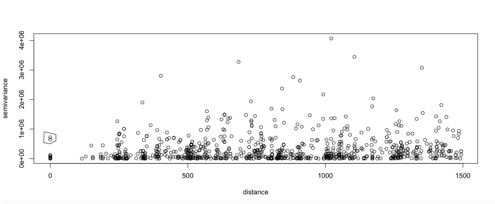

class: title-slide, middle

</img>
</img>

# Spatial variogram modelling

.instructors[
  GSFE01 - F. Guillaume Blanchet & Steve Vissault
]


---


```{r setup, include=FALSE}
options(htmltools.dir.version = FALSE)

library(sp)
library(gstat)
library(sf)

# Load data
hamilton <- readRDS("../data/post_process/hamilton_habitat.rds")
ham <- st_transform(hamilton, crs = 3161)
```

# Generalities about variograms

## Definition

.content-box-green[**Variogram**

A variogram displays the variance of a variable measured at two different location in space.]

---

# Variogram or semivariogram?

In the litterature there are confusions about how to call a variogram.

Some call it a **variogram** while other call it a **semivariogram**.

The reason why **semivariogram** (or semivariance) is sometimes used stem from the fact that what is represented when plotting a variogram is *half* the variance.

Bachmaier and Backes (2008) discussed this confusion and they showed that the term **variogram** should be used and that the terms *semivariance* and *semivariogram* should be avoided.

---

# Types of variogram

We will see different types of variograms today

- Cloud variogram
- Empirical variogram (sometimes referred to as *sample variogram*)
- Model variogram
- Directional variogram

---
class: inverse, center, middle

# Cloud variogram

<html><div style='float:left'></div><hr color='#EB811B' size=1px width=720px></html> 

---
# Definition

.content-box-green[.small[A **cloud variogram** displays the variance between all pairs of samples for a variable]]

## Mathematical definition

$$\begin{align}
2\gamma(\mathbf{s}_1, \mathbf{s}_2) =\gamma(\mathbf{h})=& \text{var}\left(Z(\mathbf{s}_1) - Z(\mathbf{s}_2)\right)\\
=& \text{var}\left(Z(\mathbf{s} + \mathbf{h}) - Z(\mathbf{s})\right)
\end{align}$$

So
$$\begin{align}
\gamma(\mathbf{h})= \frac{\text{var}\left(Z(\mathbf{s} + \mathbf{h}) - Z(\mathbf{s})\right)}{2}
\end{align}$$
where
.small[
- $\mathbf{s_1}$ : Location of sample 1
- $\mathbf{s_2}$ : Location of sample 2
- $Z(\mathbf{s_1})$ : Value of variable sampled at sample 1
- $Z(\mathbf{s_2})$ : Value of variable sampled at sample 2
- $\mathbf{h}$ : Distance between sample 1 and sample 2
]

---
# Visualization of the cloud variogram
```{r,echo = FALSE, fig.height=5, fig.width=12, eval=TRUE, fig.retina =2}
# Focus on 2005
ham2005 <- ham[which(ham$Year.Année == 2005),]

# Select depth
depth <- ham2005[ham2005$Variable == "Depth-Lake",]
depthNoDup <- depth[!duplicated(depth$Site.Site),]

# Select TP
tp <- ham2005[ham2005$Variable == "TP",]
tpNoDup <- tp[!duplicated(tp$Site.Site),]
tpNoDup$depth <- depthNoDup$Value.Valeur
tpSP <- as(tpNoDup, "Spatial")

maxDist <- max(dist(coordinates(tpSP)))
varioCloud <- variogram(Value.Valeur ~ 1,
                   data = tpSP,
                   cloud= TRUE,
                   cutoff = maxDist)

par(mar = c(5,6.5,0.5,0.5))
plot(varioCloud$dist, varioCloud$gamma,
     xlab = "Distance (m)",
     ylab = "",
     cex.lab = 2, las = 1)
mtext(text = "Variance",side = 2, cex = 2, line = 4)
```

## Use of cloud variogram
- Exploratory analysis
- It is the basis to construct the empirical variogram

---

# Directional variogram

The variogram in the previous slide is constructed using all samples equally. 

This does not have to be the case. We can also construct a variogram using only samples in a cone in specific direction. These variograms are known as **directional variograms** 

```{r,echo = FALSE, fig.height=5, fig.width=12, eval=TRUE}
varioCloud <- variogram(Value.Valeur ~ 1,
                   data = tpSP,
                   cloud= TRUE,
                   cutoff = maxDist,
                   alpha = c(0, 45, 90, 135))

plot(varioCloud)
```

---
class: inverse, center, middle

# Empirical variogram

<html><div style='float:left'></div><hr color='#EB811B' size=1px width=720px></html> 

---
# Definition

.content-box-green[.small[An **empirical variogram** is derived by defining bins into a cloud variogram]]


## Mathematical definition

The empirical variogram is constructed based on the following equation

$$\gamma(\mathbf{h}\pm\delta)=\frac{1}{2n_{\mathbf{h}\pm\delta}}\sum_{(i,j)}^{n_{\mathbf{h}\pm\delta}}\left(Z(\mathbf{s}_i) - Z(\mathbf{s}_j)\right)^2$$

where
- $Z(\mathbf{s_i})$ : Value of variable sampled at sample i
- $Z(\mathbf{s_j})$ : Value of variable sampled at sample j
- $\mathbf{h}\pm \delta$ : bin of size $2\delta$ at distance $\mathbf{h}$
- $n_{\mathbf{h}\pm\delta}$ : Number of samples within the bin

---
# .small[Visualization of the empirical variogram]

```{r,echo = FALSE, fig.height=5, fig.width=12, eval=TRUE}
varioCloud <- variogram(Value.Valeur ~ 1,
                   data = tpSP,
                   cutoff = 3500,
                   cloud= TRUE)

bound <- seq(0,3500, by = 250)
varioEmp <- variogram(Value.Valeur ~ 1,
                   data = tpSP,
                   cutoff = 3500,
                   boundaries = bound)

par(mar = c(5,6.5,0.5,0.5))
plot(varioCloud$dist, varioCloud$gamma,
     xlab = "Distance (m)",
     ylab = "",
     cex.lab = 2, las = 1)
mtext(text = "Variance",side = 2, cex = 2, line = 4)

bin <- c(0,((varioEmp$dist[-1] - varioEmp$dist[-14])/2 + varioEmp$dist[-14]), 3500)

abline(v = bin, col = "blue", lwd = 5)

segments(x0 = bin[-15],
         x1 = bin[-1],
         y0 = varioEmp$gamma,
         y1 = varioEmp$gamma,
         col = "orange",
         lwd = 5)
```
## Guidelines to contruct an empirical variogram
.small[
- More bins at small distances
- There should be enough values in each bin
- Defining the *right* variogram is problem specific
]


---
# Building an empirical variogram

**Total Phosphorus in sediment in the Harbour of Hamilton (Ontario)**

```{r, echo = FALSE, message=FALSE, out.height="70%", out.width="100%"}
library(mapview)
mapview(tpSP, zcol="Value.Valeur")
```

---

# Building an empirical variogram

## Step 1 - Study spatial autocorrelation

### Lagged scatter plot (take 1)

Lagged scatter plot draw point pairs at a specific separation distances. 

---
# Building an empirical variogram

```{r, echo = FALSE, fig.align="center", fig.width=12}
hscat(Value.Valeur ~ 1,
      data = tpSP,
      breaks = seq(0,maxDist, by = 500))
```

.small[There seems to be some structure among samples at distances between 0 and 1000 m.]

---
# Building an empirical variogram

## Step 1 - Study spatial autocorrelation

### Lagged scatter plot (take 2)

Lets look at finer bins within the first 2000 m (just to be on the safe side)

---
# Building an empirical variogram

```{r, echo = FALSE, fig.align="center", fig.width=12}
hscat(Value.Valeur ~ 1,
      data = tpSP,
      breaks = seq(0,2000, by = 100))
```

This results confirms that there is some autocorrelation structure within the first 1000 m.  

---

# Building an empirical variogram

## Step 2 - Cloud variogram 

Construct a cloud variogram with a maximum distance of 1500 m (again just to be on the safe side).

```{r, echo = FALSE, fig.align="center", fig.width=12, fig.height=5}
varioCloud <- variogram(Value.Valeur ~ 1,
                   data = tpSP,
                   cloud= TRUE,
                   cutoff = 1500)

par(mar = c(5,6.5,0.5,0.5))
plot(varioCloud$dist, varioCloud$gamma,
     xlab = "Distance (m)",
     ylab = "",
     cex.lab = 2, las = 1)
mtext(text = "Variance",side = 2, cex = 2, line = 4)
```

---

# Building an empirical variogram

## Step 3 - Check for outliers

```{r, eval=FALSE}
outliers <- plot(varioCloud, digitize = TRUE)
```


```{r echo=FALSE, out.width="90%"}

```


---

# Building an empirical variogram

## Step 4 - Remove outlier (if any)

Here is an example of how to do this
```{r, eval = FALSE}
tpSP <- tpSP[-6,]
```

---
# Building an empirical variogram

## Step 5 - Redraw the cloud variogram

```{r, echo = TRUE, eval = FALSE}
varioCloud <- variogram(Value.Valeur ~ 1, data = tpSP,
                   cloud= TRUE,cutoff = 1500)

plot(varioCloud)
```

```{r, echo = FALSE, fig.align="center", fig.width=12, fig.height=5}
varioCloud <- variogram(Value.Valeur ~ 1,
                   data = tpSP,
                   cloud= TRUE,
                   cutoff = 800)

par(mar = c(5,6.5,0.5,0.5))
plot(varioCloud$dist, varioCloud$gamma,
     xlab = "Distance (m)",
     ylab = "",
     cex.lab = 2, las = 1)
mtext(text = "Variance",side = 2, cex = 2, line = 4)
```

---

# Building an empirical variogram

## Step 6 - Define the bins

Recall that :
- More bins at small distances
- There should be enough values in each bin

```{r,echo = TRUE, fig.height=5, fig.width=12, eval=TRUE}
# Define bin limits
binLimit <- c(seq(0,1000,by = 100),
              seq(1200,1500, by = 200))

# Construct variogram
varioEmpGood <- variogram(Value.Valeur ~ 1,
                          data = tpSP,
                          cutoff = 1500,
                          boundaries = binLimit)
```

---

# Building an empirical variogram

## Step 6 - Define the bins

```{r,echo = TRUE, eval=TRUE, fig.align='center', fig.width=12, fig.height=5}
plot(varioEmpGood, cex = 2, pch = 19)
```

---

# Building an empirical variogram

## Step 6 - Define the bins

```{r,echo = TRUE, eval=TRUE}
head(varioEmpGood)
```

---
class: inverse, center, middle

# Model variogram

<html><div style='float:left'></div><hr color='#EB811B' size=1px width=720px></html> 

---

# Model variogram

The model variogram fits the empirical variogram.

Variogram (empirical and model alike) have a typical structure, to which some terminology is typically used.

```{r echo=FALSE, out.width="90%"}
knitr::include_graphics("https://aegis4048.github.io/jupyter_images/basic_variogram.png")
```


---

# Type of model variogram

There exist many types of model variograms. 

In the `gstat` package, 17 different types of model variograms have been implemented. 

.pull-left[
- `Nug` : nugget
- `Exp` : exponential
- `Sph` : spherical
- `Gau` : gaussian
- `Exclass` : Exponential class
- `Mat` : Matérn
- `Ste` : Stein
- `Cir` : circular
- `Lin` : linear
]
.pull-right[
- `Bes` : bessel
- `Pen` : pentaspherical
- `Per` : periodic
- `Hol` : hole
- `Log` : logarithmic
- `Pow` : power
- `Spl` : spline
- `Leg` : Legendre
- `Err` : Measurement error
- `Int` : Intercept
]
---

# Type of model variogram


```{r, echo = FALSE, fig.align="center", fig.width=12}
show.vgms()
```

---
# The Spherical model

```{r, echo = FALSE, message=FALSE, warning=FALSE, fig.height=3.5, fig.width=12, fig.align="center"}
library(gstat)
res <- show.vgms(max = 15, range = c(5, 10), plot = FALSE, models = "Sph")
par(mfrow = c(1,2), mar = c(1,1,1,1), oma = c(3,3,0,0))
plot(res[1:50,2:1], 
     type = "l", 
     lwd = 3,
     col = "blue",
     xaxt = "n",
     yaxt = "n")
legend("bottomright",
       legend = "Range = 5",
       cex = 2)

plot(res[51:100,2:1], 
     type = "l", 
     lwd = 3,
     col = "blue",
     xaxt = "n",
     yaxt = "n")
legend("bottomright",
       legend = "Range = 10",
       cex = 2)
mtext("Distance", side = 1, cex = 2, outer = TRUE)
mtext("Variance", side = 2, cex = 2, outer = TRUE)
```

.small[
$$\gamma(\boldsymbol{h}) = \left\{\begin{align}
\sigma^2_0 + \sigma^2_c\left(\frac{3\boldsymbol{h}}{2\nu}-\frac{1\boldsymbol{h^3}}{2\nu^3}\right), &\qquad 0 < \boldsymbol{h} \le \nu\\
\sigma^2_0 + \sigma^2_c, &\qquad \boldsymbol{h} \ge \nu\\
\end{align}\right.$$

- $\boldsymbol{h}$ is the distance between two samples
- $\sigma^2_0 + \sigma^2_c$ is the variance (sill)
- $\sigma^2_0$ is the nugget effect
- $\nu$ is the effective range

**Note** : When $\sigma^2_0 = 1$ and $\sigma^2_c = 1$ this model is called the *Standard Spherical Model*.
]

---
# The Exponential model

```{r, echo = FALSE, message=FALSE, warning=FALSE, fig.height=3.5, fig.width=12, fig.align="center"}
library(gstat)
res <- show.vgms(max = 15, range = c(2, 5), plot = FALSE, models = "Exp")
par(mfrow = c(1,2), mar = c(1,1,1,1), oma = c(3,3,0,0))
plot(res[1:50,2:1], 
     type = "l", 
     lwd = 3,
     col = "blue",
     xaxt = "n",
     yaxt = "n")
legend("bottomright",
       legend = "Range = 2",
       cex = 2)

plot(res[51:100,2:1], 
     type = "l", 
     lwd = 3,
     col = "blue",
     xaxt = "n",
     yaxt = "n")
legend("bottomright",
       legend = "Range = 5",
       cex = 2)
mtext("Distance", side = 1, cex = 2, outer = TRUE)
mtext("Variance", side = 2, cex = 2, outer = TRUE)
```

$$\gamma(\boldsymbol{h}) = \sigma^2_0 + \sigma^2_c\left(1 - e^{-\boldsymbol{h}/\nu}\right)$$

- $\boldsymbol{h}$ is the distance between two samples
- $\sigma^2_0 + \sigma^2_c$ is the variance (sill)
- $\sigma^2_0$ is the nugget effect
- $\nu$ is the effective range

---
# The Matérn model

```{r, echo = FALSE, message=FALSE, warning=FALSE, fig.height=3.5, fig.width=12, fig.align="center"}
library(gstat)
res <- show.vgms(kappa.range = c(5, 10),
          max = 15, plot = FALSE, models = "Mat")
par(mfrow = c(1,2), mar = c(1,1,1,1), oma = c(3,3,3,0))
plot(res[1:50,2:1], 
     type = "l", 
     lwd = 3,
     col = "blue",
     xaxt = "n",
     yaxt = "n")
legend("bottomright",
       legend = expression(paste(kappa,"= 5")),
       cex = 2)

plot(res[51:100,2:1], 
     type = "l", 
     lwd = 3,
     col = "blue",
     xaxt = "n",
     yaxt = "n")
legend("bottomright",
       legend = expression(paste(kappa,"= 10")),
       cex = 2)
mtext("Distance", side = 1, cex = 2, outer = TRUE)
mtext("Variance", side = 2, cex = 2, outer = TRUE)
mtext("Sill = 1 - Range = 1", side = 3, cex = 2, outer = TRUE)
```

.small[
$$\gamma(\boldsymbol{h}) = \frac{\sigma^2}{2^{\nu-1}\Gamma(\nu)}\left(\kappa \boldsymbol{h}\right)^\nu K_\nu\left(\kappa \boldsymbol{h}\right)$$
]

where
- $\boldsymbol{h}$ is the distance between two samples
- $\sigma^2$ is the variance (sill)
- $\nu$ is the range
- $\kappa$ is scaling parameter (always $> 0$)
- $K_\nu$ is a Bessel function of the second kind of order $\nu$
---

# Choosing the right model variogram

Choosing the right model variogram depends on the problem at hand.

However, there are a few important aspects worth knowing

## General aspects
- The variogram chosen should relate to the question you are asking
- This is not only curve fitting

## Aspects specific to a model variogram

- Some doubts have been raised about the **hole** model variogram
- The **spline** model variogram seems to need exceeding large range values to fit an empirical variogram properly

---

# Fitting a model variogram

There exist a few ways to fit a model variogram to an empirical variogram.

## Visually

By trying to visually pass the best possible curve to the empirical variogram.

This approach is implemented in the package `geoR` in the function `eyefit`.

.Large[.red[**Not recommended**]]

---

# Fitting a model variogram

There exist a few ways to fit a model variogram to an empirical variogram. In the `fit.variogram` function of the `gstat` package.

## Weighting the importance of the bin
Using as weight
- The number of points per bin (`fit.method = 1`)
$$n_{\mathbf{h}_j}$$
- The number of points per bin divided by the variance (`fit.method = 2`)
$$\frac{n_{\mathbf{h}_j}}{\gamma(\boldsymbol h_j)^2}$$

---

# Fitting a model variogram

There exist a few ways to fit a model variogram to an empirical variogram. In the `fit.variogram` function of the `gstat` package.

## Weighting the importance of the bin
Using as weight
- The number of points per bin divided by the squared bin size (`fit.method=7`)
$$\frac{n_{\mathbf{h}_j}}{\boldsymbol h_j^2}$$

This is the default option in `fit.variogram`. 

In practice, it is a technique that has been shown to work well, but is not supported by theory.

---

# Fitting a model variogram

There exist a few ways to fit a model variogram to an empirical variogram. In the `fit.variogram` function of the `gstat` package.

## Using ordinary least squares (OLS)
The sums of squares between the model and the data is minimized (`fit.method=6`)

$$\sum\left(Z(\mathbf{s})-\widehat{Z}(\mathbf{s})\right)^2$$

---

# Fitting a model variogram

## Using restricted maximum likelihood (REML)

The `fit.variogram.reml` function  of the `gstat` package uses a restricted maximum likelihood (REML) approach to fit the model variogram to the empirical variogram. 

This is approach is rather slow and it is not recommended if there are more than 100 samples. 

This approach relies on all distances (pairs of points;  cloud variogram) to fit the model variogram.

---

# Choosing the right fitting approach

The short answer is : 

.Large["It depends !"]

.small[
Visual fitting: Use **only** to get some starting values for other model fitting approaches. 

`fit.method = 1` : If you want to place more emphasis on the number of points in bins.

`fit.method = 2` : If you want to account for the variation of the data in bins.

`fit.method = 6` : If you **do not** want to account for the size of the bins. This approach only fits the model to the points (That's it!) This may be interesting to use if the bins all have the same number of points.

`fit.method = 7` :  If you want to account for the size (in distance) of bins.

`fit.variogram.reml` : Theoretically, this is often the best approach, but because it is slow, it becomes useless to use it for moderate to large datasets (more 100 samples). 
]

---

# Fitting a model variogram in practice

**Total Phosphorus in sediment in the Harbour of Hamilton (Ontario)**

```{r, echo = FALSE, message=FALSE, out.height="55%", out.width="100%"}
library(mapview)
mapview(tpSP, zcol="Value.Valeur")
```

## Step 1 - Let's think of what we are measuring
- Do we know how it should vary in space (from the litterature) ?
- Are there some particularities of the sampling we need to account for ?
- ...

---
# Fitting a model variogram in practice

## Step 2 - Choosing the right model variogram

Let's look at the empirical variogram
```{r,echo = FALSE, eval=TRUE, fig.align='center', fig.width=12, fig.height=4}
plot(varioEmpGood, cex = 2, pch = 19)
```

We also need to think about:
- The property of the variable we are modelling
- The reasons **why** we want to model it

For this example, we will use the **exponential** model variogram.

---
# Fitting a model variogram in practice

## .small[Step 3 - Choosing the way to fit the model variogram]

Always keep in mind : 
- The property of the variable we are modelling
- The reasons **why** we want to model it

Let's use REML !

---
# Fitting a model variogram in practice

## Step 4 - Selecting good starting values

```{r, fig.align='center', fig.height=5, fig.width=10}
modelIni <-  vgm(psill = 5.5e5, model = "Exp",
                 range = 400, nugget = 100)

plot(varioCloud, model = modelIni, lwd = 3)
```

---
# Fitting a model variogram in practice

## Step 5 - Fitting the model variogram

```{r, eval = TRUE}
tpDF <- data.frame(x = coordinates(tpSP)[,1],
                   y = coordinates(tpSP)[,2],
                   tpSP@data)

modelVario <- fit.variogram.reml(Value.Valeur ~ 1,
                                 ~ x + y, 
                                 data = tpDF,
                                 model =modelIni)
```

---
# Fitting a model variogram in practice

## Step 6 - Visualization

```{r, echo = FALSE, fig.align='center', fig.height=5, fig.width=12}
plot(varioCloud, model = modelVario, lwd = 3)
```
---
class: inverse, center, middle

# Spatial kriging

---

# Definition

.content-box-green[
**Kriging**

A form of linear interpolation that guaranties the minimum variance in the estimation. It is also known as *Gaussian process regression*.
]

## Types of kriging

There are three different form of kriging
- Simple kriging
- Ordinary kriging
- Universal kriging

---

# .footnotesize[General mathematical definition of kriging]
$$\widehat{Z}(\mathbf{s}_\alpha, t_\phi) = \mathbf{X}(\mathbf{s}_\alpha, t_\phi)\widehat{\boldsymbol\beta} + \boldsymbol{v}\mathbf{V}^{-1}(Z(\mathbf{s}, t) - \mathbf{X}\widehat{\boldsymbol\beta})$$
where
- $Z(\mathbf{s}, t)$ the values at all sampled locations in space and through time
- $\widehat{Z}(\mathbf{s}_\alpha, t_\phi)$ is the kriging estimation at location $\mathbf{s}_\alpha$ at time $t_\phi$
- $\mathbf{X}(\mathbf{s}_\alpha, t_\phi)$ is an explanatory variable gathered at location $\mathbf{s}_\alpha$ at time $t_\phi$
- $\widehat{\boldsymbol\beta}$ is an *estimated* regression parameter
- $\boldsymbol{v}$ is a vector of *estimated* covariance of 
  - $Z(\mathbf{s}_\alpha, t_\phi)$ the value at location $\mathbf{s}_\alpha$ at time $t_\phi$
  - $Z(\mathbf{s}, t)$ the values at all sampled locations 
- $\mathbf{V}^{-1}$ is the inverse of covariance matrix obtained from the model variogram

---

# Simple kriging

$$\widehat{Z}(\mathbf{s}_\alpha, t_\phi) = \mathbf{X}(\mathbf{s}_\alpha, t_\phi)\widehat{\boldsymbol\beta} + \boldsymbol{v}\mathbf{V}^{-1}(Z(\mathbf{s}, t) - \mathbf{X}\widehat{\boldsymbol\beta})$$

In the previous equation, if $\widehat{\boldsymbol\beta}$ is known and it represents, we have a **simple kriging**.

The reason for this terminology is that many aspects of the equation above simplifies

$$\begin{align}
\widehat{Z}(\mathbf{s}_\alpha, t_\phi) &= \mathbf{X}(\mathbf{s}_\alpha, t_\phi)\widehat{\boldsymbol\beta} + \boldsymbol{v}\mathbf{V}^{-1}(Z(\mathbf{s}, t) - \mathbf{X}\widehat{\boldsymbol\beta})\\
&= \widehat{\boldsymbol\beta} + \boldsymbol{v}\mathbf{V}^{-1}(Z(\mathbf{s}, t) - \widehat{\boldsymbol\beta})\\&= \text{constant}_1 + \boldsymbol{v}\mathbf{V}^{-1}\text{constant}_2
\end{align}$$

In short, in simple kriging, we make the interpolation using solely a weighted covariance.

---

# Ordinary kriging

$$\widehat{Z}(\mathbf{s}_\alpha, t_\phi) = \mathbf{X}(\mathbf{s}_\alpha, t_\phi)\widehat{\boldsymbol\beta} + \boldsymbol{v}\mathbf{V}^{-1}(Z(\mathbf{s}, t) - \mathbf{X}\widehat{\boldsymbol\beta})$$

In ordinary kriging, we also assume that there is only a single regression parameter $\widehat{\boldsymbol\beta}$ that accounts for the model intercept, but it is estimated.


$$\begin{align}
\widehat{Z}(\mathbf{s}_\alpha, t_\phi) &= \mathbf{X}(\mathbf{s}_\alpha, t_\phi)\widehat{\boldsymbol\beta} + \boldsymbol{v}\mathbf{V}^{-1}(Z(\mathbf{s}, t) - \mathbf{X}\widehat{\boldsymbol\beta})\\
&= \widehat{\boldsymbol\beta} + \boldsymbol{v}\mathbf{V}^{-1}(Z(\mathbf{s}, t) - \widehat{\boldsymbol\beta})\\
\end{align}$$


---

# Universal kriging

$$\widehat{Z}(\mathbf{s}_\alpha, t_\phi) = \mathbf{X}(\mathbf{s}_\alpha, t_\phi)\widehat{\boldsymbol\beta} + \boldsymbol{v}\mathbf{V}^{-1}(Z(\mathbf{s}, t) - \mathbf{X}\widehat{\boldsymbol\beta})$$

In universal kriging, $\mathbf{X}(\mathbf{s}_\alpha, t_\phi)$ and $\mathbf{X}$ can represent one (or a few explanatory) and as such $\widehat{\boldsymbol\beta}$ will represent at least two regression parameters (the intercept and one or a few "slopes"), all of which are estimated.

This is known as *universal* kriging because it is very flexible and thus more universal.

---
# .footnotesize[How to perform a kriging interpolation ?]

## Step 1 - Build model variogram

We need to use everything we learned on the variogram because kriging relies on the model variogram.

```{r, echo = FALSE, fig.align='center', fig.height=5, fig.width=12}
plot(varioCloud, model = modelVario, lwd = 3)
```

---
# .footnotesize[How to perform a kriging interpolation ?]

## Step 2 - Define a grid

```{r, eval = TRUE, echo = TRUE}
library(sf)
library(raster)
lake <- st_read("../data/raw/hamilton_harbor.gdb", layer="waterbody_2", quiet = TRUE)

# Align the projections
lake <- st_transform(lake, st_crs(tpSP))

# Create the reference grid for model projection (using the lake extent)
r_ref <- raster(lake,res=100)
r_ref
```
As for inverse distance weighting, we build a grid of $100 \times 100$ m.

---
# .footnotesize[How to perform a kriging interpolation ?]
## Step 3 - Interpolate !
### Simple kriging

```{r}
# Simple kriging
skModel <- gstat(formula = Value.Valeur ~ 1, location = tpSP,
            model = modelVario, beta = 2)

# Build interpolation map
skMap <- interpolate(object = r_ref, model = skModel, debug = 0)
```

---
# .footnotesize[How to perform a kriging interpolation ?]
## Step 3 - Interpolate !
### Ordinary kriging
```{r}
# Ordinary kriging
okModel <- gstat(formula = Value.Valeur ~ 1, location = tpSP,
            model = modelVario)

# Build interpolation map
okMap <- interpolate(object = r_ref, model = okModel, debug = 0)
```

---
# .footnotesize[How to perform a kriging interpolation ?]
## Step 4 - Visualize
### Simple kriging

```{r, echo = FALSE, fig.align='center', out.height="55%", out.width="100%"}
# Mask 
skMapMask <- mask(skMap, lake) 
mapview(skMapMask)
```

---

# .footnotesize[How to perform a kriging interpolation ?]
## Step 4 - Visualize
### Ordinary kriging

```{r, echo = FALSE, fig.align='center',out.height="55%", out.width="100%"}
# Mask 
okMapMask <- mask(okMap, lake) 
mapview(okMapMask)
```
