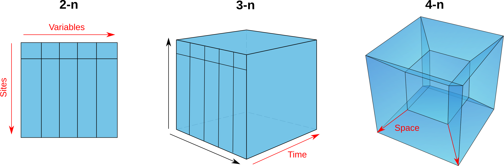
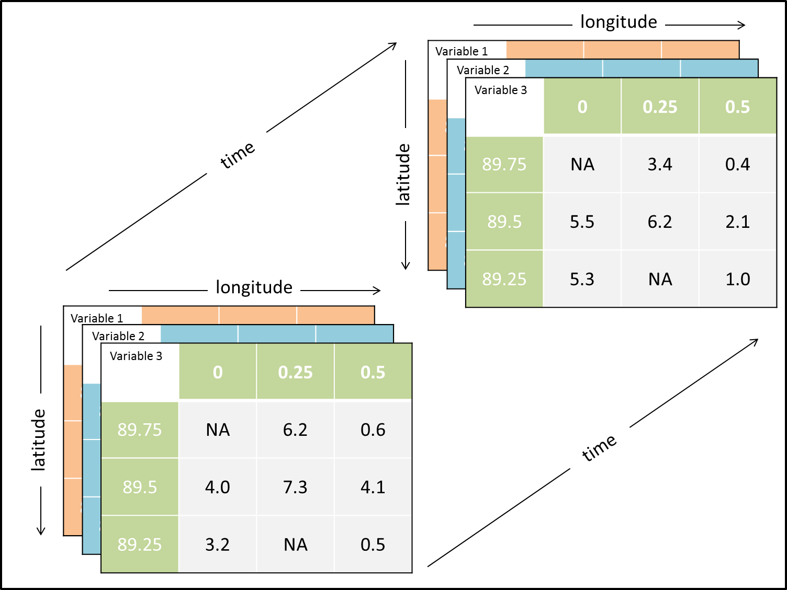

class: title-slide, middle

</img>
</img>

# Visualizing spatiotemporal data with R

.instructors[
  GSFE01 - F. Guillaume Blanchet & Steve Vissault
]

```{r setup, include=FALSE}
options(htmltools.dir.version = FALSE)
```

---
class: clear, middle

## `r icon::fa("slideshare")` Slides available at:
https://steveviss.github.io/PR-GSFE01/st_manip/index.html

## `r icon::fa("tag")` Solutions of all practices:
https://steveviss.github.io/PR-GSFE01/st_manip/practice.html


---
class: inverse, center, middle

# The curse of dimensionality

<html><div style='float:left'></div><hr color='#EB811B' size=1px width=720px></html> 

---

# The data multi-dimensionality problem

```{r echo=FALSE, out.width="100%", fig.align='center'}

```

---

# Multi-dimensionality problem

**The problem** - It is not easy to store and handle biological informations through all of these dimensions. 

--

.pull-left[
**Storage formats**
- 2-d: Tabular data CSV, shapefiles (.shp) / rasters (.grd)
- 3-d: NetCDF, Hierarchical Data Format
- n-d: Spatial SQL database, split the dataset into multiples tables (e.g. PostgreSQL)
]
.pull-right[
   ```{r echo=FALSE, out.width="100%", fig.align='center'}

```  
]

**Take home** - Having the right format can help solve that problem, and thus
make your life easier when comes the time to play and analyze the data.

???
- Tabular format lot of redundancies (increase the risk of having errors in the entries)
- NetCDF/HDF convenient for gridded data / rasters (not always suitable for none gridded data)
-  (Nested structure / Star schema)
     - field stations metadata and locations
     - Samples attached to field stations
     - Observations attached to samples

---
class: inverse, center, middle

# Handle temporal aspect in R

<html><div style='float:left'></div><hr color='#EB811B' size=1px width=720px></html> 

---

# Declare `date` in R

**When you import a CSV files, you may encounter those situations.**

**Situation 1**: The date column is a vector of characters.
```{r, echo = FALSE}
c("1990-01-04","1990-05-01","1990-08-07")
```

**Situation 2**: Date informations are scattered in 3 differents columns
```{r, echo = FALSE}
data.frame(
     year = rep(1990,3),
     month = c(1,5,7),
     day = c("4","1","7")
)
```

When performing spatio-temporal analysis, we need this temporal information to be recognized properly.

This is where the `Date` format comes in handy.

---
# Situation 1

Dates entries might have different format (hopefully not in the same column).

**Solution:** the function `as.Date()` will coerce the character vector to a vector of class `Date` allowing dates to be handle properly.

```{r}
d1 <- as.Date(c("1990-01-04","1990-05-01","1990-08-07"))
d1

d2<- as.Date(c("1990/01/04","1990/05/01","1990/08/07"))
d2
```

---
# Situation 1

If your input dates are not in a standard format, the `format` argument can be
used to force a specific structure on the dates. 

.pull-left[
.code60[
```{r}
as.Date('1/15/2001',format='%m/%d/%Y')
as.Date('April 26, 2001',format='%B %d, %Y')
as.Date('22JUN01',format='%d%b%y')
```
]
]
.pull-right[
.small[
| Code |	Value |
| --- | --- |
| %d |	Day of the month (decimal number) |
| %m |	Month (decimal number) |
| %b |	Month (abbreviated) |
| %B |	Month (full name) |
| %y |	Year (2 digit) |
| %Y |	Year (4 digit) |
]
]

---
# Situation 1

A lot effort as been place in R to account for the diversity of data structure

.tiny[
| Code |	Meaning |	Code	 | Meaning |
| --- | --- | --- | --- | --- |
| %a |	Abbreviated weekday |	%A	| Full weekday |
| %b |	Abbreviated month |	%B	| Full month |
| %c |	Locale-specific date and time |	%d	| Decimal date |
| %H |	Decimal hours (24 hour) |	%I	| Decimal hours (12 hour) |
| %j |	Decimal day of the year |	%m	| Decimal month |
| %M |	Decimal minute |	%p	| Locale-specific AM/PM |
| %S |	Decimal second |	%U	| Decimal week of the year (starting on Sunday) |
| %w |	Decimal Weekday (0=Sunday) |	%W	| Decimal week of the year (starting on Monday) |
| %x |	Locale-specific Date |	%X	| Locale-specific Time |
| %y |	2-digit year |	%Y	| 4-digit year |
| %z |	Offset from GMT |	%Z	| Time zone (character) |
]

---
# Situation 1

If you have several dates formats... 

--

deep breath... 
Have a look at the [`lubridate`](https://lubridate.tidyverse.org/) package.

--

In the R universe, you're never alone... 

```{r, infos = FALSE}
library(lubridate)
sampleDates <- c("4/6/2004","4/6/2004","4/6/2004","4/7/2004",
        "4/6/2004","4/7/2004","2014-08-12")
parse_date_time(sampleDates, c("Ymd", "mdY"))
```

???
POSIXct is the number of seconds since the epoch. In this case the epoch Jan 1st 1970.
POSIXlt is a mixed text and character format like

---
# Situation 2

Date informations are scattered in 3 differents columns

```{r, echo = FALSE}
s2 <- data.frame(
     year = rep(1990,3),
     month = c(1,5,7),
     day = c("4","1","7")
)
s2
```

**Solution:** Concatanate the three columns and convert the vector as dates.

```{r}
d <- paste(s2$year, s2$month, s2$day, sep = "-")
d
d <- as.Date(d)
d
```

---

# Taking advantage of dates format

**Logical test, useful for filtering (e.g. comparing dates)**

```{r}
d <- as.Date(c("1990-01-04","1990-05-01","1980-08-07"))
d[3] > d[2]
sort(d)
```

---

# Taking advantage of dates format

**Reformat / reduce the resolution on the fly**

```{r}
d <- as.Date(c("1990-01-04","1990-05-01","1980-08-07"))
d_y <- format(d, "%Y")
d_y
table(d_y)
```

???
Now, that time have been briefly covered in R. It's time to visualize date in a spatiotemporal context

---
class: inverse, center, middle

# Visualizing spatial-temporal data

<html><div style='float:left'></div><hr color='#EB811B' size=1px width=720px></html> 

---
# Import Halibut occurences 

Let's play with the [OBIS database](https://obis.org/). 

In this illustration, we want to know where the
Halibut (*Hippoglossus hippoglossus*) occurs in the St. Lawrence estuary.

```{r, cache = TRUE}
library(robis)
library(sf)
halibut <- occurrence(scientificname = "Hippoglossus hippoglossus", 
               geometry="POLYGON((-64.84626027288095 48.91641792598304,-64.01129933538095 50.49356505646415,-68.82331105413095 50.11464395818477,-71.04254933538095 46.80876488134784,-64.84626027288095 48.91641792598304))"
          )

# Convert the data.frame retuned to a sf object
sf_halibut <- st_as_sf(halibut, 
                    coords = c("decimalLongitude","decimalLatitude"),
                    crs = 4326)
```

---
# Import Halibut occurences 

```{r}
nrow(sf_halibut) # number of occurrences
```

```{r, echo = FALSE, out.width = "100%", out.height = "70%"}
mapview::mapview(sf_halibut)
```

---
# Import Halibut occurences 

```{r, out.width = "100%", out.height = "70%"}
nrow(sf_halibut) # number of occurrences
```

```{r, echo = FALSE, out.width = "100%", out.height = "70%"}
table(sf_halibut$institutionCode)
```

---
# Explore occurrences through times

Select the date informations

```{r, echo = FALSE,, message = FALSE}
library(dplyr)
```

```{r, infos = FALSE}
head(names(sf_halibut))

sf_halibut <- sf_halibut %>% dplyr::select(day, month, year, depth) 

# Create a new column with the proper dates
sf_halibut$dates <- as.Date(paste(sf_halibut$day, sf_halibut$month, sf_halibut$year, sep = "-"))
class(sf_halibut$dates)
```

---
# Explore occurrences through times

```{r, fig.retina = 2, fig.align="center"}
library(ggplot2)
ggplot(sf_halibut) + geom_sf()
```

---
# Explore occurrences through times

```{r, fig.retina = 2, fig.align="center"}
library(ggplot2)
ggplot(sf_halibut) + geom_sf() + facet_wrap(~year)
```

---
# Explore occurrences through times

**Some aesthetics**

Add a third dimension: color the points based on the depth.

```{r, fig.retina = 2, fig.align="center", fig.height = 5, fig.width = 10}
ggplot() + 
     geom_sf(data = filter(sf_halibut, year > 2006), aes(col = depth)) + 
     facet_wrap(~year)
```


---
# Explore occurrences through times

**Add more spatial context**

```{r, cache = TRUE, infos = FALSE, warnings = FALSE, messages = FALSE}
poly_ca <- raster::getData('GADM', country='CA', level=1)
sf_ca <- st_as_sf(poly_ca)
sf_estuary <- st_crop(sf_ca, st_as_sfc(st_bbox(sf_halibut)))
```

```{r, fig.retina = 2, eval = FALSE}
ggplot() + 
     geom_sf(data = sf_estuary, fill = "grey50", col = "white") + 
     geom_sf(data = filter(sf_halibut, year > 2006), aes(col = depth)) + 
     facet_wrap(~year)
```


---
# Explore occurrences through times

**Add more spatial context**

```{r, fig.retina = 2, echo = FALSE, fig.align="center", fig.height = 6, fig.width = 10}
ggplot() + 
     geom_sf(data = sf_estuary, fill = "grey50", col = "white") + 
     geom_sf(data = filter(sf_halibut, year > 2006), aes(col = depth)) + 
     facet_wrap(~year)
```

---
# Produce count grids

If you have a large dataset with a high density of points, it is a good idea to
summarize the informations using a grid of abundance counts.

```{r, infos = FALSE}
library(raster)
# get number of years
years <- unique(sf_halibut$year)

# Create a reference grid
ref_grid <- raster(sf_halibut, res=0.05)
```

---
# Produce count grids

If you have a large dataset with a high density of points, it is a good idea to
summarize the informations using a grid of abundance counts.

```{r, infos = FALSE}
library(sf)
# Open empty stack
stack_count <- stack()

for(i in 1:length(years)){
     # Filter for one year (years[i])
     sf_halibut_yr <- filter(sf_halibut, year == years[i])
     
     # Prepare the geometry
     sp_halibut_yr <- as(st_geometry(sf_halibut_yr), "Spatial")

     # Count points per cell
     rs_count <- rasterize(sp_halibut_yr, ref_grid, fun = 'count')

     # Add the layer to the stack
     stack_count <- addLayer(stack_count,rs_count)
}

names(stack_count) <- years
```
---
# Produce count grids

```{r, infos = FALSE, out.width = "100%" , out.height = "80%"}
mapview::mapview(sum(stack_count, na.rm = TRUE))
```

---
class: clear, middle

# Practice

1. Collect the occurences of your favorite species on OBIS.
     - `robis::occurrence(scientificname = "Hippoglossus hippoglossus")`
2. Visualize the distribution of this species across several years using `ggplot2`.
3. Produce count grids per year for this species.

---
class: inverse, middle, center

# Visualizing variability 

<html><div style='float:left'></div><hr color='#EB811B' size=1px width=720px></html> 

---

# Spatial variability

**Hovmöller plot**

```{r, echo =FALSE, fig.retina = 2, fig.align = 'center'}
data("NOAA_df_1990", package = "STRbook")

Tmax <- filter(NOAA_df_1990,     # subset the data
              proc == "Tmax" &   # only max temperature
              month %in% 5:9 &   # May to September
              year == 1993)      # year of 1993

lim_lat <- range(Tmax$lat)        # latitude range

lat_axis <- seq(lim_lat[1],       # latitude axis
                lim_lat[2],
                length=25)

Tmax$t <- Tmax$julian - 728049     # create a new time variable
Tmax_grid <- Tmax
dists <- abs(outer(Tmax$lat, lat_axis, "-"))
Tmax_grid$lat <- lat_axis[apply(dists, 1, which.min)]

Tmax_lat_Hov <- group_by(Tmax_grid, lat, t) %>%
                summarise(z = mean(z))

library(STRbook)
Hovmoller_lat <- ggplot(Tmax_lat_Hov) +            # take data
        geom_tile(aes(x = lat, y = t, fill = z)) + # plot
        fill_scale(name = "degF") +     # add color scale
        scale_y_reverse() +             # rev y scale
        ylab("Day number (days)") +     # add y label
        xlab("Latitude (degrees)") +    # add x label
        theme_bw()                      # change theme

Hovmoller_lat
```

---

# Temporal variability

**Trends plots by stations**

```{r, echo =FALSE, fig.retina = 2, fig.align = 'center'}
Tmax <- filter(NOAA_df_1990,     # subset the data
              proc == "Tmax" &   # only max temperature
              month %in% 5:9 &   # May to September
              year == 1993)      # year of 1993

Tmax_av <- group_by(Tmax, date) %>%
           summarise(meanTmax = mean(z))

gTmaxav <-
    ggplot() +
    geom_line(data = Tmax,aes(x = date, y = z, group = id),
              colour = "blue", alpha = 0.04) +
    geom_line(data = Tmax_av, aes(x = date, y = meanTmax)) +
    xlab("Month") + ylab("Maximum temperature (degF)") +
    theme_bw()

gTmaxav
```

---
class: inverse, center, middle

# Spatio-temporal data organisation

<html><div style='float:left'></div><hr color='#EB811B' size=1px width=720px></html> 

---

# Spatio-temporal data organisation

To perform spatio-temporal variograms with `gstat`, we need to convert our data
into one of the following different `spacetime` classes of object.

- full grid (STF): a combination of any `sp` object and any `xts` object to represent all
possible locations on the implied space-time lattice;
- sparse grid (STS): same as STF, but contains only the non-missing space-time combinations on a space-time lattice;
- irregular (STI): an irregular space-time data structure, where each point is allocated a spatial coordinate and a time stamp;

To build these objects, the best way is to use the `stConstruct` function in the `spacetime` package.

---

# Spatio-temporal data organisation

The original input when dealing with the `spacetime` pacakge has to be like the one in the following example.

```{r, echo = FALSE, message= FALSE}
library(spacetime)
# load the data
data(air)
# melt the matrix
colnames(air) <- 1:ncol(air)
raw_air <- reshape2::melt(air, na.rm = TRUE)
names(raw_air) <- c("station_id","time_id","pm10")

# Add ids
dates <- data.frame(time_id=1:length(dates) ,dates = dates)
stations <- as.data.frame(stations, xy = TRUE)
stations$station_id <- rownames(stations)

# merge time
raw_air <- merge(raw_air,dates)
raw_air <- merge(raw_air,stations)

# Clean the air df
raw_air <- raw_air[,-2]
names(raw_air)[4:5] <- c("lng","lat")
```

```{r}
head(raw_air)
```

Each row corresponds to an observation / sample taken at a specific location and at particular time point.
The time, space and variables have distinct columns. 

---

# Spatio-temporal data organisation

If each columns is a combination of years and variables (`wide` format), you might want to reshape the data into a `long` format.
We can obtain this data structure with the function `gather()`.

```{r echo=FALSE, out.width="60%", fig.align='center'}
knitr::include_graphics("https://uc-r.github.io/public/images/dataWrangling/gather1.png")
```

Have a look at [this website](https://uc-r.github.io/tidyr), and [the tidyr sheet cheat](https://github.com/rstudio/cheatsheets/raw/master/data-import.pdf).

---

# Spatio-temporal data organisation

Last bit of information: Convert `sf` object back to a complete `data.frame`.

```{r}
# Add the coordinates to the data.frame
halibut <- data.frame(st_coordinates(sf_halibut), sf_halibut)
head(halibut)
# Drop the geometry column
halibut$geometry <- NULL
class(halibut)
```


---

# Playing with the `stConstruct` function

```{r}
library(spacetime)
library(sp)

spaceTime_air <- stConstruct(raw_air, 
                              c("lng","lat"),
                              "dates", 
                              crs = CRS("+init=epsg:4326"))
class(spaceTime_air)
```

---

# Playing with the `stConstruct` function

```{r}
raw_air_2005_2010 <- subset(raw_air, dates > as.Date("2005-01-01") 
                              & dates < as.Date("2010-12-31"))
STIDF_air_2005_2010 <- stConstruct(raw_air_2005_2010, c("lng","lat"),"dates", 
                              crs = CRS("+init=epsg:4326"))
STFDF_air_2005_2010 <- as(STIDF_air_2005_2010, "STFDF")
```
---

# Playing with the `stConstruct` function

.small[
```{r}
summary(STFDF_air_2005_2010)
```
]

